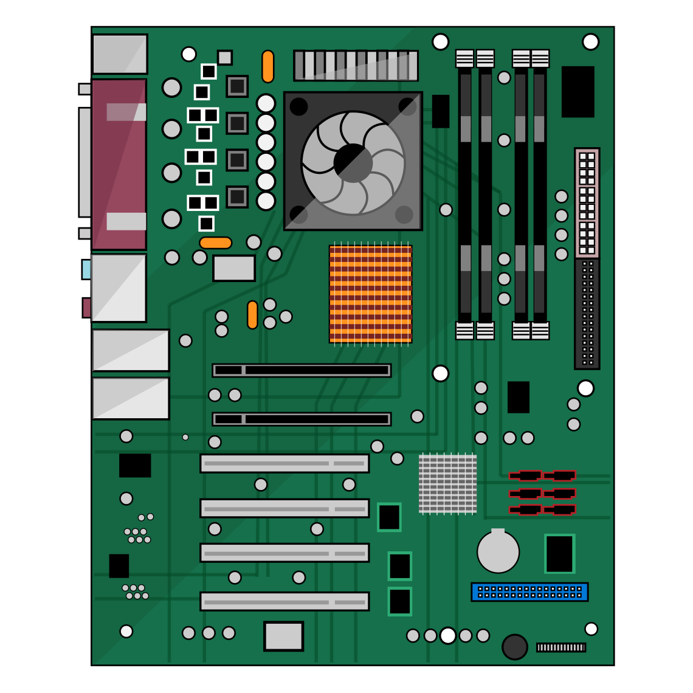
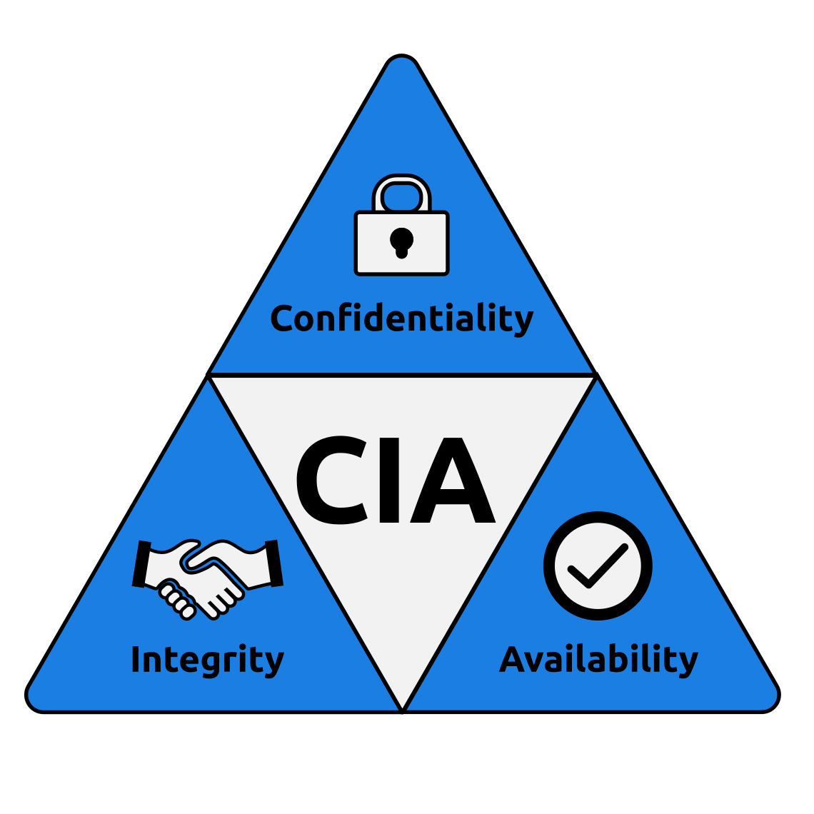
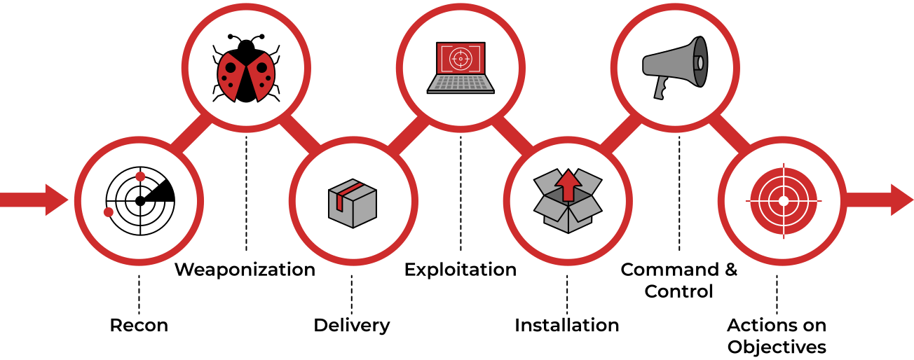

# Intro to Offensive Security

## Web Application Security

## Operating System Security 

The Operating System (OS) is the layer sitting between the hardware and the applications and programs you are running. Example programs you would use daily might include a web browser, such as Firefox, Safari, and Chrome, and a messaging app, such as Signal, WhatsApp, and Telegram. All the programs and applications cannot run directly on the computer hardware; however, they run on top of the operating system. The operating system allows these programs to access the hardware according to specific rules.

Some operating systems are designed to run on laptops and personal desktops, such as MS Windows 11 and macOS. Other operating systems are designed specifically for smartphones, such as Android and iOS. There are also operating systems intended for servers; examples include MS Windows Server 2022, IBM AIX, and Oracle Solaris. Finally, there are operating systems that you can use on a personal computer and server; one example is Linux. The image below shows the popularity of the different operating systems used to browse the Internet according to Statcounter based on the data collected during January 2022.

When we talk about security, we should think of protecting three things:

- Confidentiality: You want to ensure that secret and private files and information are only available to intended persons.
- Integrity: It is crucial that no one can tamper with the files stored on your system or while being transferred on the network.
- Availability: You want your laptop or smartphone to be available to use anytime you decide to use it. 

### Common Examples of OS Security 

Three common weaknesses targeted by malicious users:

- Authentication and Weak Passwords
- Weak File Permissions
- Malicious Programs

**Authentication and Weak Passwords**  
Authentication is the act of verifying your identity, be it a local or a remote system. Authentication can be achieved via three main ways:

- Something you know, such as a password or a PIN code.
- Something you are, such as a fingerprint.
- Something you have, such as a phone number via which you can receive an SMS message.
- Since passwords are the most common form of authentication, they are also the most attacked. Many users tend to use easy-to-guess passwords or the same password on many websites. Moreover, some users rely on personal details such as date of birth and name of their pet, thinking that this is easy to remember and unknown to attackers. However, attackers are aware of this tendency among users

**Weak File Permissions**  
Proper security dictates the principle of least privilege. In a work environment, you want any file accessible only by those who need to access it to get work done. On a personal level, if you are planning a trip with family or friends, you might want to share all the files related to the trip plan with those going on that trip; you don’t want to share such files publicly. That’s the principle of least privilege, or in simpler terms, “who can access what?”

Weak file permissions make it easy for the adversary to attack confidentiality and integrity. They can attack confidentiality as weak permissions allow them to access files they should not be able to access. Moreover, they can attack integrity as they might modify files that they should not be able to edit.

**Access to Malicious Programs**  
The last example we will consider is the case of malicious programs. Depending on the type of malicious program, it can attack confidentiality, integrity, and availability.

Some types of malicious programs, such as Trojan horses, give the attacker access to your system. Consequently, the attacker would be able to read your files or even modify them.

Some types of malicious programs attack availability. One such example is ransomware. Ransomware is a malicious program that encrypts the user's files. Encryption makes the file(s) unreadable without knowing the encryption password; in other words, the files become gibberish without decryption (reversing the encryption). The attacker offers the user the ability to restore availability, i.e., regain access to their original files: they would give them the encryption password if the user is willing to pay the “ransom.”

### Practical Example of OS Security 

## Network Security

### Methodology 
 
Every “operation” requires some form of planning to achieve success. If you are interested in wildlife photography, you cannot just grab a camera and head to the jungle unless you don’t care about the outcome. For a safe and successful wildlife photography tour, you would need to learn more about the animals you want to shoot with your camera. This includes the habits of the animals and the dangers to avoid. The same would apply to a military operation against a target or breaking into a target network.

Breaking into a target network usually includes a number of steps. According to Lockheed Martin, the Cyber Kill Chain has seven steps:

- **Recon**: Recon, short for reconnaissance, refers to the step where the attacker tries to learn as much as possible about the target. Information such as the types of servers, operating system, IP addresses, names of users, and email addresses, can help the attack’s success.
- **Weaponization**: This step refers to preparing a file with a malicious component, for example, to provide the attacker with remote access.
- **Delivery**: Delivery means delivering the “weaponized” file to the target via any feasible method, such as email or USB flash memory.
- **Exploitation**: When the user opens the malicious file, their system executes the malicious component.
- **Installation**: The previous step should install the malware on the target system.
- **Command & Control (C2)**: The successful installation of the malware provides the attacker with a command and control ability over the target system.
- **Actions on Objectives**: After gaining control over one target system, the attacker has achieved their objectives. One example objective is Data Exfiltration (stealing target’s data).

Another analogy would be a thief interested in a target house. The thief will spend some time learning about the target house, who lives there, when they leave, and when they return home. The thief will determine whether they have security cameras and alarm systems. Once enough information has been gathered, the thief will plan the best entrance strategy. Physical theft planning and execution resemble, in a way, the malicious attack that aims to break into a network and steal data.

### Exam 

Instructions
nmap MACHINE_IP
ftp MACHINE_IP 
> get secret.txt 

## My Key Takeaways 

**OS Security**

In OS Security look for these 3 common weakness:
- Authentication and Weak Passwords
- Weak File Permissions
- Malicious Programs

Take a look if there's a post it note 
You can use top common password to bruteforce root
> you can reference this kind of repo 
> https://github.com/carlospolop/su-bruteforce 

Reuse a password 

--- 

