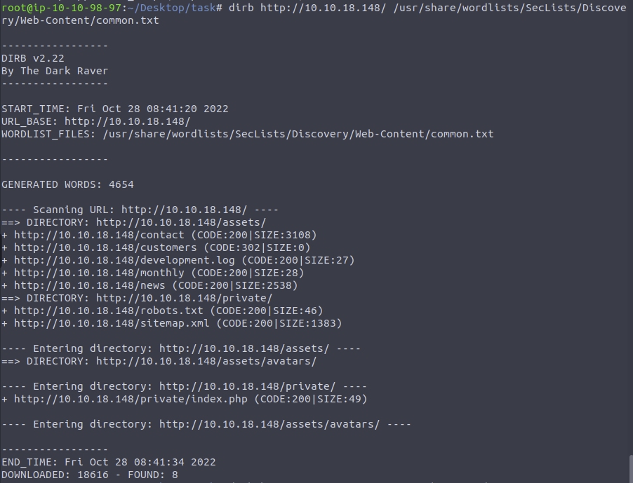

# INTRODUCTION TO WEB HACKING 

Common in-built browser tools in Web Hacking
- **View Source** - Use your browser to view the human-readable source code of a website.
- **Inspector** - Learn how to inspect page elements and make changes to view usually blocked content.
- **Debugger** - Inspect and control the flow of a page's JavaScript
- **Network** - See all the network requests a page makes.

## WALKING AN APPLICATION

### Viewing the Page Source 

Check for comments, hidden links, hidden directories 
- " \<a hrefs" 
- "http" 
- "https"

### Developer Tools - Debugger

Debugger use JS Break Points 

### Developer Tools - Network
Check XHR requests
post ang get request
- headers, payloads

## CONTENT DISCOVERY 

Content can be many things, a file, video, picture, backup, a website feature. When we talk about content discovery, we're not talking about the obvious things we can see on a website; it's the things that aren't immediately presented to us and that weren't always intended for public access.

### Manual Discovery  - robots.txt
check robots.txt access disallow paths

### Manual Discovery  - Favico

when a developer fails to use favico
you can get the favicon.ico and check it md5sum

example
```bash
curl https://static-labs.tryhackme.cloud/sites/favicon/images/favicon.ico | md5sum
```

Then Find it here
`https://wiki.owasp.org/index.php/OWASP_favicon_database`

### Manual Discovery  - sitemap.xml 
Check all urls mentioned

### Manual Discovery  - HTTP Headers  

curl $URL -v 
it will print the HEADERS as well

### OSINT - Google Hacking / Dorking 

There are also external resources available that can help in discovering information about your target website; these resources are often referred to as OSINT or (Open-Source Intelligence) as they're freely available tools that collect information:

|  Filter  |       Example      |                          Description                         |
|:--------:|:------------------:|:------------------------------------------------------------:|
|   site   | site:tryhackme.com |    returns results only from the specified website address   |
|   inurl  |     inurl:admin    |    returns results that have the specified word in the URL   |
| filetype |    filetype:pdf    |     returns results which are a particular file extension    |
|  intitle |    intitle:admin   | returns results that contain the specified word in the title |

More information about google hacking can be found here: https://en.wikipedia.org/wiki/Google_hacking

### OSINT - Wappalyzer 
Wappalyzer (https://www.wappalyzer.com/) is an online tool and browser extension that helps identify what technologies a website uses, such as frameworks, Content Management Systems (CMS), payment processors and much more, and it can even find version numbers as well.

### OSINT - Wayback Machine 
Wayback Machine
The Wayback Machine (https://archive.org/web/) is a historical archive of websites that dates back to the late 90s. You can search a domain name, and it will show you all the times the service scraped the web page and saved the contents. This service can help uncover old pages that may still be active on the current website.

### OSINT - S3 Buckets 
The owner of the files can set access permissions to either make files public, private and even writable. Sometimes these access permissions are incorrectly set and inadvertently allow access to files that shouldn't be available to the public. The format of the S3 buckets is http(s)://{name}.s3.amazonaws.com where {name} is decided by the owner, such as tryhackme-assets.s3.amazonaws.com.
S3 buckets can be discovered in many ways, such as finding the URLs in the website's page source, GitHub repositories, or even automating the process. One common automation method is by using the company name followed by common terms such as {name}-assets, {name}-www, {name}-public, {name}-private, etc

### Automated Discovery 

Using ffuf:
```
ffuf -w /usr/share/wordlists/SecLists/Discovery/Web-Content/common.txt -u http://10.10.18.148/FUZZ
```


fuff is more simpler results


using dirb:
```
dirb http://10.10.18.148/ /usr/share/wordlists/SecLists/Discovery/Web-Content/common.txt 
```


dirb is more verbose 

using GoBuster: 
```
gobuster dir --url http://10.10.18.148/ -w /usr/share/wordlists/SecLists/Discovery/Web-Content/common.txt 
```


gobuster is really fast and i like the output more


## SUBDOMAIN ENUMERATION

3 Subdomain enumeration methods:
- Brute Force
- OSINT
- Virtual Host 

### OSINT - SSL/TLS Certificates 

The purpose of Certificate Transparency logs is to stop malicious and accidentally made certificates from being used. We can use this service to our advantage to discover subdomains belonging to a domain, sites like https://crt.sh and https://ui.ctsearch.entrust.com/ui/ctsearchui offer a searchable database of certificates that shows current and historical results.

Example result in **https://crt.sh** 


## AUTHENTICATION

## My TakeAways

**WALKING APPLICATION**
- Look at comments
- Assets/directory
- look for zips
- secret urls

**CONTENT DISCOVERY**

Start by asking what is purpose of the website.
what is nature of it services? 
what is the content of the website. 

Content can be many things, a file, video, picture, backup, a website feature. 

3 main ways to discover content
- Manually
- Automated 
- OSINT (Open-Source Intelligence).


