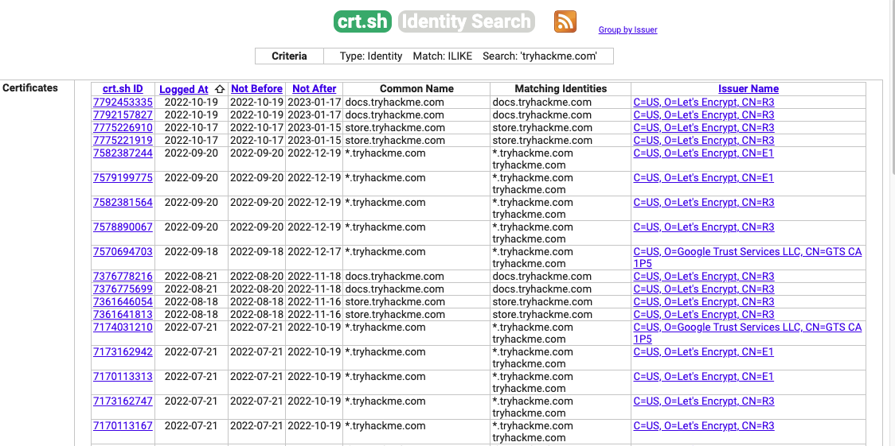
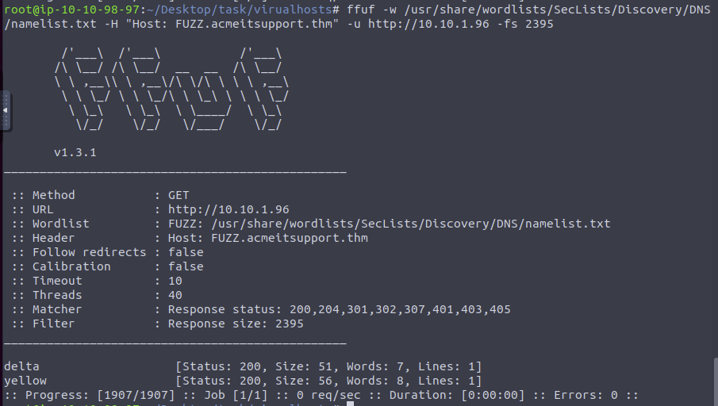

# INTRODUCTION TO WEB HACKING 

Common in-built browser tools in Web Hacking
- **View Source** - Use your browser to view the human-readable source code of a website.
- **Inspector** - Learn how to inspect page elements and make changes to view usually blocked content.
- **Debugger** - Inspect and control the flow of a page's JavaScript
- **Network** - See all the network requests a page makes.

## WALKING AN APPLICATION

### Viewing the Page Source 

Check for comments, hidden links, hidden directories 
- " \<a hrefs" 
- "http" 
- "https"

### Developer Tools - Debugger

Debugger use JS Break Points 

### Developer Tools - Network
Check XHR requests
post ang get request
- headers, payloads

## CONTENT DISCOVERY 

Content can be many things, a file, video, picture, backup, a website feature. When we talk about content discovery, we're not talking about the obvious things we can see on a website; it's the things that aren't immediately presented to us and that weren't always intended for public access.

### Manual Discovery  - robots.txt
check robots.txt access disallow paths

### Manual Discovery  - Favico

when a developer fails to use favico
you can get the favicon.ico and check it md5sum

example
```bash
curl https://static-labs.tryhackme.cloud/sites/favicon/images/favicon.ico | md5sum
```

Then Find it here
`https://wiki.owasp.org/index.php/OWASP_favicon_database`

### Manual Discovery  - sitemap.xml 
Check all urls mentioned

### Manual Discovery  - HTTP Headers  

curl $URL -v 
it will print the HEADERS as well

### OSINT - Google Hacking / Dorking 

There are also external resources available that can help in discovering information about your target website; these resources are often referred to as OSINT or (Open-Source Intelligence) as they're freely available tools that collect information:

|  Filter  |       Example      |                          Description                         |
|:--------:|:------------------:|:------------------------------------------------------------:|
|   site   | site:tryhackme.com |    returns results only from the specified website address   |
|   inurl  |     inurl:admin    |    returns results that have the specified word in the URL   |
| filetype |    filetype:pdf    |     returns results which are a particular file extension    |
|  intitle |    intitle:admin   | returns results that contain the specified word in the title |

More information about google hacking can be found here: https://en.wikipedia.org/wiki/Google_hacking

### OSINT - Wappalyzer 
Wappalyzer (https://www.wappalyzer.com/) is an online tool and browser extension that helps identify what technologies a website uses, such as frameworks, Content Management Systems (CMS), payment processors and much more, and it can even find version numbers as well.

### OSINT - Wayback Machine 
Wayback Machine
The Wayback Machine (https://archive.org/web/) is a historical archive of websites that dates back to the late 90s. You can search a domain name, and it will show you all the times the service scraped the web page and saved the contents. This service can help uncover old pages that may still be active on the current website.

### OSINT - S3 Buckets 
The owner of the files can set access permissions to either make files public, private and even writable. Sometimes these access permissions are incorrectly set and inadvertently allow access to files that shouldn't be available to the public. The format of the S3 buckets is http(s)://{name}.s3.amazonaws.com where {name} is decided by the owner, such as tryhackme-assets.s3.amazonaws.com.
S3 buckets can be discovered in many ways, such as finding the URLs in the website's page source, GitHub repositories, or even automating the process. One common automation method is by using the company name followed by common terms such as {name}-assets, {name}-www, {name}-public, {name}-private, etc

### Automated Discovery 

Using ffuf:
```
ffuf -w /usr/share/wordlists/SecLists/Discovery/Web-Content/common.txt -u http://10.10.18.148/FUZZ
```


fuff is more simpler results


using dirb:
```
dirb http://10.10.18.148/ /usr/share/wordlists/SecLists/Discovery/Web-Content/common.txt 
```


dirb is more verbose 

using GoBuster: 
```
gobuster dir --url http://10.10.18.148/ -w /usr/share/wordlists/SecLists/Discovery/Web-Content/common.txt 
```


gobuster is really fast and i like the output more


## SUBDOMAIN ENUMERATION

3 Subdomain enumeration methods:
- Brute Force
- OSINT
- Virtual Host 

### OSINT - SSL/TLS Certificates 

The purpose of Certificate Transparency logs is to stop malicious and accidentally made certificates from being used. We can use this service to our advantage to discover subdomains belonging to a domain, sites like https://crt.sh and https://ui.ctsearch.entrust.com/ui/ctsearchui offer a searchable database of certificates that shows current and historical results.

Example result in **https://crt.sh** 


crt.sh is good for tracking with date when it was renewed

### OSINT - Search Engines

Search Engines
Search engines contain trillions of links to more than a billion websites, which can be an excellent resource for finding new subdomains. Using advanced search methods on websites like Google, such as the site: filter, can narrow the search results. For example, "-site:www.domain.com site:*.domain.com" would only contain results leading to the domain name domain.com but exclude any links to www.domain.com; therefore, it shows us only subdomain names belonging to domain.com.

Go to Google and use the search term -site:www.tryhackme.com  site:*.tryhackme.com, which should reveal a subdomain for tryhackme.com; use that subdomain to answer the question below.


### DNS Bruteforce 

Bruteforce DNS (Domain Name System) enumeration is the method of trying tens, hundreds, thousands or even millions of different possible subdomains from a pre-defined list of commonly used subdomains. Because this method requires many requests, we automate it with tools to make the process quicker. In this instance, we are using a tool called dnsrecon to perform this


### OSINT - Sublis3r 
To speed up the process of OSINT subdomain discovery, we can automate the above methods with the help of tools like Sublist3r

```
user@thm:~$ ./sublist3r.py -d acmeitsupport.thm

          ____        _     _ _     _   _____
         / ___| _   _| |__ | (_)___| |_|___ / _ __
         \___ \| | | | '_ \| | / __| __| |_ \| '__|
          ___) | |_| | |_) | | \__ \ |_ ___) | |
         |____/ \__,_|_.__/|_|_|___/\__|____/|_|

         # Coded By Ahmed Aboul-Ela - @aboul3la

[-] Enumerating subdomains now for acmeitsupport.thm
[-] Searching now in Baidu..
[-] Searching now in Yahoo..
[-] Searching now in Google..
[-] Searching now in Bing..
[-] Searching now in Ask..
[-] Searching now in Netcraft..
[-] Searching now in Virustotal..
[-] Searching now in ThreatCrowd..
[-] Searching now in SSL Certificates..
[-] Searching now in PassiveDNS..
[-] Searching now in Virustotal..
[-] Total Unique Subdomains Found: 2
web55.acmeitsupport.thm
www.acmeitsupport.thm
user@thm:~$
```

### Virtual Hosts 


Some subdomains aren't always hosted in publically accessible DNS results, such as development versions of a web application or administration portals. Instead, the DNS record could be kept on a private DNS server or recorded on the developer's machines in their /etc/hosts file (or c:\windows\system32\drivers\etc\hosts file for Windows users) which maps domain names to IP addresses.
Because web servers can host multiple websites from one server when a website is requested from a client, the server knows which website the client wants from the Host header. We can utilise this host header by making changes to it and monitoring the response to see if we've discovered a new website.
Like with DNS Bruteforce, we can automate this process by using a wordlist of commonly used subdomains.

Start an AttackBox and then try the following command against the Acme IT Support machine to try and discover a new subdomain.

```
user@machine$ ffuf -w /usr/share/wordlists/SecLists/Discovery/DNS/namelist.txt -H "Host: FUZZ.acmeitsupport.thm" -u http://10.10.1.96
# This command gave a lot of output and we need to filter
```
The above command uses the -w switch to specify the wordlist we are going to use. The -H switch adds/edits a header (in this instance, the Host header), we have the FUZZ keyword in the space where a subdomain would normally go, and this is where we will try all the options from the wordlist. 

Because the above command will always produce a valid result, we need to filter the output. We can do this by using the page size result with the -fs switch. Edit the below command replacing {size} with the most occurring size value from the previous result and try it on the AttackBox

```
user@machine$ ffuf -w /usr/share/wordlists/SecLists/Discovery/DNS/namelist.txt -H "Host: FUZZ.acmeitsupport.thm" -u http://10.10.1.96 -fs {size}
```



size: 2395
get what is the most common number in size 


## AUTHENTICATION BYPASS

we will learn about different ways website authentication methods can be bypassed, defeated or broken. These vulnerabilities can be some of the most critical as it often ends in leaks of customers personal data


### USERNAME ENUMERATION

Website error messages are great resources for collating this information to build our list of valid usernames. We have a form to create a new user account if we go to the Acme IT Support website (http://10.10.147.156/customers/signup) signup page.

If you try entering the username admin and fill in the other form fields with fake information, you'll see we get the error An account with this username already exists. We can use the existence of this error message to produce a list of valid usernames already signed up on the system by using the ffuf tool below. The ffuf tool uses a list of commonly used usernames to check against for any matches.

```bash
user@tryhackme$ ffuf -w /usr/share/wordlists/SecLists/Usernames/Names/names.txt -X POST -d "username=FUZZ&email=x&password=x&cpassword=x" -H "Content-Type: application/x-www-form-urlencoded" -u http://10.10.147.156/customers/signup -mr "username already exists"
```


In the above example, the `-w` argument selects the file's location on the computer that contains the list of usernames that we're going to check exists. The `-X` argument specifies the request method, this will be a GET request by default, but it is a POST request in our example. The `-d` argument specifies the data that we are going to send. In our example, we have the fields username, email, password and cpassword. We've set the value of the username to FUZZ. In the ffuf tool, the FUZZ keyword signifies where the contents from our wordlist will be inserted in the request. The `-H` argument is used for adding additional headers to the request. In this instance, we're setting the `Content-Type` to the webserver knows we are sending form data. The `-u` argument specifies the URL we are making the request to, and finally, the `-mr` argument is the text on the page we are looking for to validate we've found a valid username.

The ffuf tool and wordlist come pre-installed on the AttackBox or can be installed locally by downloading it from https://github.com/ffuf/ffuf.

> BOOKMARK
> REDO, RE TRY THIS CHAPTER 
> AS I HAVE EXPERIENCE BUGS
> All of the response are 200 


## IDOR

## FILE INCLUSION


## My TakeAways

**WALKING APPLICATION**
- Look at comments
- Assets/directory
- look for zips
- secret urls

**CONTENT DISCOVERY**

Start by asking what is purpose of the website.
what is nature of it services? 
what is the content of the website. 

Content can be many things, a file, video, picture, backup, a website feature. 

3 main ways to discover content
- Manually
- Automated 
- OSINT (Open-Source Intelligence).


