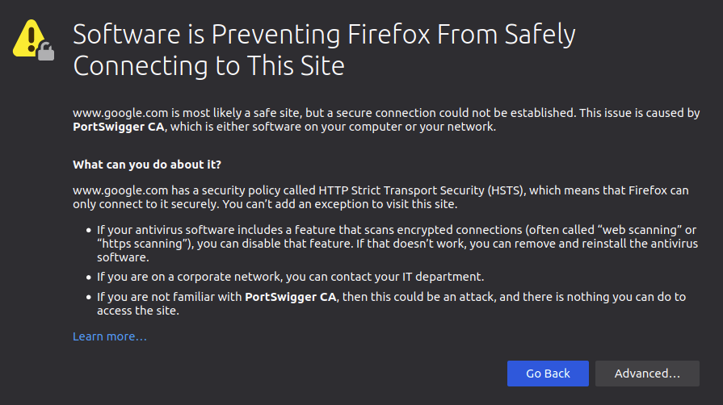
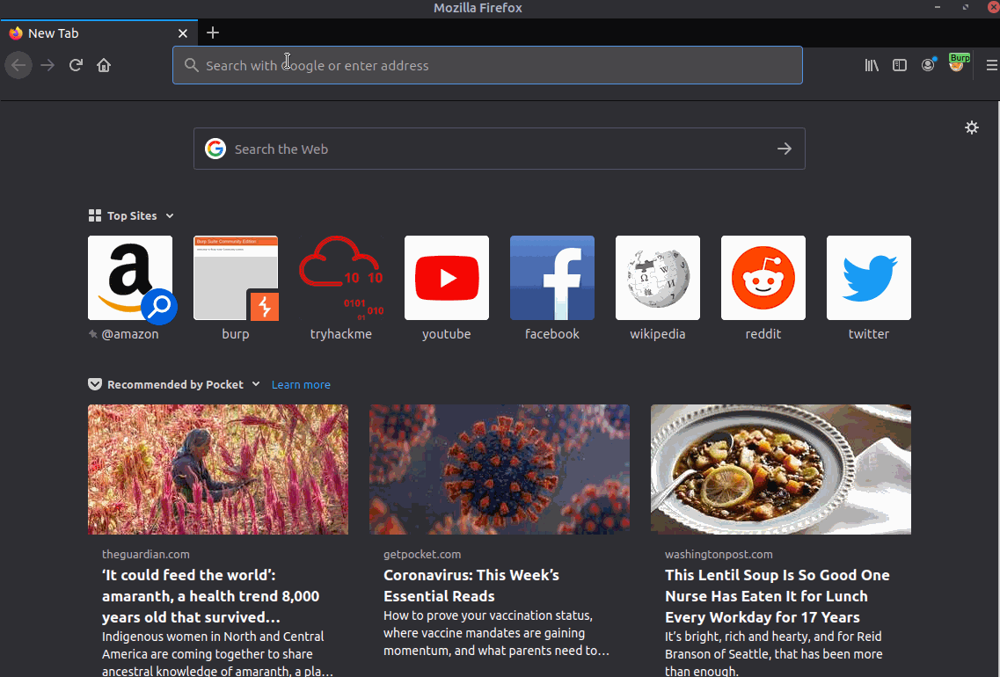

# Burpsuite 

## Burpsuite Basics 

Whilst Burp Community has a relatively limited feature-set compared to the Professional edition, it still has many superb tools available. These include:

- Proxy: The most well-known aspect of Burp Suite, the Burp Proxy allows us to intercept and modify requests/responses when interacting with web applications.
- Repeater: The second most well-known Burp feature -- Repeater -- allows us to capture, modify, then resend the same request numerous times. This feature can be absolutely invaluable, especially when we need to craft a payload through trial and error (e.g. in an SQLi -- Structured Query Language Injection) or when testing the functionality of an endpoint for flaws.
- Intruder: Although harshly rate-limited in Burp Community, Intruder allows us to spray an endpoint with requests. This is often used for bruteforce attacks or to fuzz endpoints.
- Decoder: Though less-used than the previously mentioned features, Decoder still provides a valuable service when transforming data -- either in terms of decoding captured information, or encoding a payload prior to sending it to the target. Whilst there are other services available to do the same job, doing this directly within Burp Suite can be very efficient.
- Comparer: As the name suggests, Comparer allows us to compare two pieces of data at either word or byte level. Again, this is not something that is unique to Burp Suite, but being able to send (potentially very large) pieces of data directly into a comparison tool with a single keyboard shortcut can speed things up considerably.
- Sequencer: We usually use Sequencer when assessing the randomness of tokens such as session cookie values or other supposedly random generated data. If the algorithm is not generating secure random values, then this could open up some devastating avenues for attack.

### PROXY

Burp Proxy is the most fundamental (and most important!) of the tools available in Burp Suite. It allows us to capture requests and responses between ourselves and our target. These can then be manipulated or sent to other tools for further processing before being allowed to continue to their destination

"Match and Replace" section; this allows you to perform regexes on incoming and outgoing requests. For example, you can automatically change your user agent to emulate a different web browser in outgoing requests or remove all cookies being set in incoming requests. Again, you are free to make your own rules here.

### PROXYING HTTPS

What happens if we navigate to a site with TLS enabled? For example, `https://google.com/`

Firefox is telling us that the `Portswigger Certificate Authority (CA)` isn't authorised to secure the connection

**ACTION ITEM**  

First, with the proxy activated head to http://burp/cert; this will download a file called cacert.der -- save it somewhere on your machine.

Next, type `about:preferences` into your Firefox search bar and press enter; this takes us to the FireFox settings page. Search the page for "certificates" and we find the option to "View Certificates"

Clicking the "View Certificates" button allows us to see all of our trusted CA certificates. We can register a new certificate for Portswigger by pressing "Import" and selecting the file that we just downloaded.

In the menu that pops up, select "Trust this CA to identify websites", then click Ok:

We should now be free to visit any TLS enabled sites that we wish!

