# Network Security

 Network Security Modules:

- Passive Reconnaissance
- Active Reconnaissance
- Nmap Live Host Discovery
- Nmap Basic Port Scans
- Nmap Advanced Port Scans
- Nmap Post Port Scans
- Protocols and Servers
- Protocols and Servers 2
- Network Security Challenge

 after we define passive reconnaissance and active reconnaissance, we focus on essential tools related to passive reconnaissance. We will learn three command-line tools:

- whois to query WHOIS servers
- nslookup to query DNS servers
- dig to query DNS servers

We use whois to query WHOIS records, while we use nslookup and dig to query DNS database records. These are all publicly available records and hence do not alert the target.


We will also learn the usage of two online services:

DNSDumpster
Shodan.io

## PASSIVE VS ACTIVE RECONNAISSANCE 

In passive reconnaissance, you rely on publicly available knowledge. It is the knowledge that you can access from publicly available resources without directly engaging with the target. Think of it like you are looking at target territory from afar without stepping foot on that territory.

Passive reconnaissance activities include many activities, for instance:
- Looking up DNS records of a domain from a public DNS server.
- Checking job ads related to the target website.
- Reading news articles about the target company.

Active reconnaissance, on the other hand, cannot be achieved so discreetly. It requires direct engagement with the target. Think of it like you check the locks on the doors and windows, among other potential entry points.
examples:
- Connecting to one of the company servers such as HTTP, FTP, and SMTP.
- Calling the company in an attempt to get information (social engineering).
- Entering company premises pretending to be a repairman.

### WHOIS 
WHOIS is a request and response protocol that follows the RFC 3912 specification. A WHOIS server listens on TCP port 43 for incoming requests. The domain registrar is responsible for maintaining the WHOIS records for the domain names it is leasing. The WHOIS server replies with various information related to the domain requested. Of particular interest, we can learn:

- Registrar: Via which registrar was the domain name registered?
- Contact info of registrant: Name, organization, address, phone, among other things. (unless made hidden via a privacy service)
- Creation, update, and expiration dates: When was the domain name first registered? When was it last updated? And when does it need to be renewed?
- Name Server: Which server to ask to resolve the domain name?

### NSLOOKUP AND DIG 

Find the IP address of a domain name using `nslookup`, which stands for Name Server Look Up.

| Query type |       Result       |
|:----------:|:------------------:|
|      A     |   IPv4 Addresses   |
|    AAAA    |   IPv6 Addresses   |
|    CNAME   |   Canonical Name   |
|     MX     |    Mail Servers    |
|     SOA    | Start of Authority |
|     TXT    |     TXT Records    |


For instance, nslookup -type=A tryhackme.com 1.1.1.1 (or nslookup -type=a tryhackme.com 1.1.1.1 as it is case-insensitive) can be used to return all the IPv4 addresses used by tryhackme.com.
 
### Conclusion 

|         Lookup WHOIS record         |           whois tryhackme.com           |
|:-----------------------------------:|:---------------------------------------:|
|         Lookup DNS A records        |      nslookup -type=A tryhackme.com     |
| Lookup DNS MX records at DNS server | nslookup -type=MX tryhackme.com 1.1.1.1 |
|        Lookup DNS TXT records       |     nslookup -type=TXT tryhackme.com    |
|         Lookup DNS A records        |           dig tryhackme.com A           |
| Lookup DNS MX records at DNS server |      dig @1.1.1.1 tryhackme.com MX      |
|        Lookup DNS TXT records       |          dig tryhackme.com TXT          |

## ACTIVE RECONNAISSANCE

Active reconnaissance requires you to make some kind of contact with your target. This contact can be a phone call or a visit to the target company under some pretence to gather more information, usually as part of social engineering. Alternatively, it can be a direct connection to the target system, whether visiting their website or checking if their firewall has an SSH port open. Think of it like you are closely inspecting windows and door locks. Hence, it is essential to remember not to engage in active reconnaissance work before getting signed legal authorization from the client.

There are also plenty of add-ons for Firefox and Chrome that can help in penetration testing. Here are a few examples:

- **FoxyProxy** lets you quickly change the proxy server you are using to access the target website. This browser extension is convenient when you are using a tool such as Burp Suite or if you need to switch proxy servers regularly. You can get FoxyProxy for Firefox from here.
- **User-Agent Switcher and Manager** gives you the ability to pretend to be accessing the webpage from a different operating system or different web browser. In other words, you can pretend to be browsing a site using an iPhone when in fact, you are accessing it from Mozilla Firefox. You can download User-Agent Switcher and Manager for Firefox here.
- **Wappalyzer** provides insights about the technologies used on the visited websites. Such extension is handy, primarily when you collect all this information while browsing the website like any other user. A screenshot of Wappalyzer is shown below. You can find Wappalyzer for Firefox here.

**PING**
-c count
-s packet size 


**telnet**
telnet $IP $PORT 
(once connected)
GET / HTTP/1.1
host: example 
( double enter)


### Conclusion 

|      Command     |                   Example                  |
|:----------------:|:------------------------------------------:|
|       ping       | ping -c 10 10.10.235.164 on Linux or macOS |
|       ping       |   ping -n 10 10.10.235.164 on MS Windows   |
|    traceroute    | traceroute 10.10.235.164 on Linux or macOS |
|      tracert     |     tracert 10.10.235.164 on MS Windows    |
|      telnet      |      telnet 10.10.235.164 PORT_NUMBER      |
| netcat as client |        nc 10.10.235.164 PORT_NUMBER        |
| netcat as server |            nc -lvnp PORT_NUMBER            | 


##  NMAP LIVE HOST DICOVERY 

This room is the first of four in this Nmap series 

- Nmap Live Host Discovery
- Nmap Basic Port Scans
- Nmap Advanced Port Scans
- Nmap Post Port Scans

We present the different approaches that Nmap uses to discover live hosts. In particular, we cover:

- **ARP scan**: This scan uses ARP requests to discover live hosts
- **ICMP scan**: This scan uses ICMP requests to identify live hosts
- **TCP/UDP ping scan**: This scan sends packets to TCP ports and UDP ports to determine live hosts.

 Nmap was created by Gordon Lyon (Fyodor), a network security expert and open source programmer. It was released in 1997 
A Nmap scan usually goes through the steps shown in the figure below, although many are optional and depend on the command-line arguments you provide.


### DISCOVERING LIVEHOST 

To visualize an ARP and PING to subnetworks
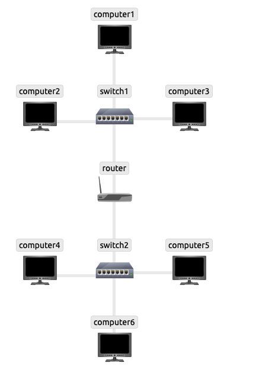

**Same subnet**


The first ping will require to make an ARP request first to know where is the location of the target.
the second request is will no longer require an ARP request because the address is cached

**Different subnet**

same from top, will first request an ARP then if it's not on the same subnet. 
the router will send another arp request to the Different subnet. 
before the ping request is received.

the second request no longer requires ARP request because address is cached 

### SUMMARY 

|        Scan Type       |              Example Command              |
|:----------------------:|:-----------------------------------------:|
|        ARP Scan        |      sudo nmap -PR -sn MACHINE_IP/24      |
|     ICMP Echo Scan     |      sudo nmap -PE -sn MACHINE_IP/24      |
|   ICMP Timestamp Scan  |      sudo nmap -PP -sn MACHINE_IP/24      |
| ICMP Address Mask Scan |      sudo nmap -PM -sn MACHINE_IP/24      |
|    TCP SYN Ping Scan   |  sudo nmap -PS22,80,443 -sn MACHINE_IP/30 |
|    TCP ACK Ping Scan   |  sudo nmap -PA22,80,443 -sn MACHINE_IP/30 |
|      UDP Ping Scan     | sudo nmap -PU53,161,162 -sn MACHINE_IP/30 |

Remember to add `-sn` if you are only interested in host discovery without port-scanning. Omitting `-sn` will let Nmap default to port-scanning the live hosts.

| Option |              Purpose             |
|:------:|:--------------------------------:|
|   -n   |           no DNS lookup          |
|   -R   | reverse-DNS lookup for all hosts |
|   -sn  |        host discovery only       |

If you want to use a specific DNS server `--dns-servers DNS_SERVER`

> return to finish notes. https://tryhackme.com/room/nmap01 


## NMAP BASIC PORT SCANS

In the previous room, we focused on discovering online systems. So far, we have covered three steps of a Nmap scan:

- Enumerate targets
- Discover live hosts
- Reverse-DNS lookup

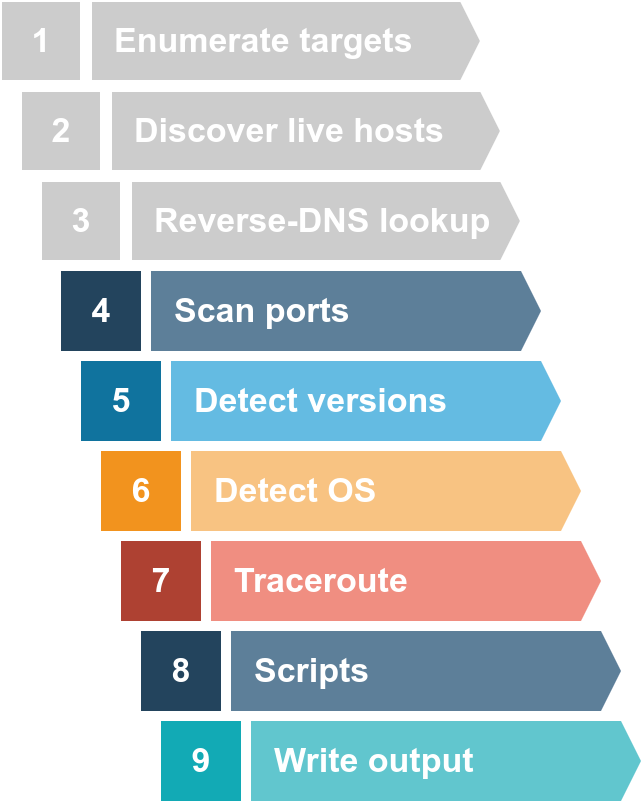

The next step would be checking which ports are open and listening and which ports are closed. Therefore, in this room and the next one, we focus on port scanning and the different types of port scans used by nmap. This room explains:

- TCP connect port scan
- TCP SYN port scan
- UDP port scan

### TCP AND UDP PORTS 

a TCP port or UDP port is used to identify a network service running on that host

At the risk of oversimplification, we can classify ports in two states:

- Open port indicates that there is some service listening on that port.
- Closed port indicates that there is no service listening on that port.

However, in practical situations, we need to consider the impact of firewalls. For instance, a port might be open, but a firewall might be blocking the packets. Therefore, Nmap considers the following six states:

- Open: indicates that a service is listening on the specified port.
- Closed: indicates that no service is listening on the specified port, although the port is accessible. By accessible, we mean that it is reachable and is not blocked by a firewall or other security appliances/programs.
- Filtered: means that Nmap cannot determine if the port is open or closed because the port is not accessible. This state is usually due to a firewall preventing Nmap from reaching that port. Nmap’s packets may be blocked from reaching the port; alternatively, the responses are blocked from reaching Nmap’s host.
- Unfiltered: means that Nmap cannot determine if the port is open or closed, although the port is accessible. This state is encountered when using an ACK scan -sA.
- Open|Filtered: This means that Nmap cannot determine whether the port is open or filtered.
- Closed|Filtered: This means that Nmap cannot decide whether a port is closed or filtered.

### TCP FLAGS

**The following figure shows the TCP header as defined in RFC 793.**
This figure looks sophisticated at first; however, it is pretty simple to understand. In the first row, we have the source TCP port number and the destination port number. We can see that the port number is allocated 16 bits (2 bytes). In the second and third rows, we have the sequence number and the acknowledgement number. Each row has 32 bits (4 bytes) allocated, with six rows total, making up 24 bytes.


- URG: Urgent flag indicates that the urgent pointer filed is significant. The urgent pointer indicates that the incoming data is urgent, and that a TCP segment with the URG flag set is processed immediately without consideration of having to wait on previously sent TCP segments.
- ACK: Acknowledgement flag indicates that the acknowledgement number is significant. It is used to acknowledge the receipt of a TCP segment.
- PSH: Push flag asking TCP to pass the data to the application promptly.
- RST: Reset flag is used to reset the connection. Another device, such as a firewall, might send it to tear a TCP connection. This flag is also used when data is sent to a host and there is no service on the receiving end to answer.
- SYN: Synchronize flag is used to initiate a TCP 3-way handshake and synchronize sequence numbers with the other host. The sequence number should be set randomly during TCP connection establishment.
- FIN: The sender has no more data to send.


### TCP CONNECT SCAN

TCP connect scan works by completing the TCP 3-way handshake. In standard TCP connection establishment, the client sends a TCP packet with SYN flag set, and the server responds with SYN/ACK if the port is open; finally, the client completes the 3-way handshake by sending an ACK.


You can choose to run TCP connect scan using `-sT`

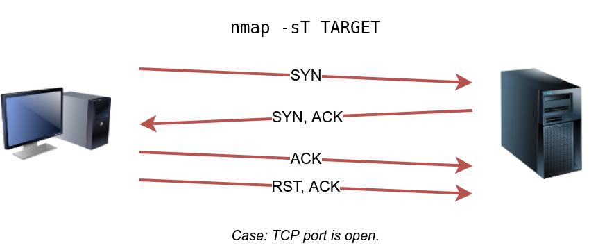


### TCP SYN 

Unprivileged users are limited to connect scan. However, the **default scan mode is SYN scan**, and it **requires** a privileged (**root or sudoer**) user to run it.

The figure below shows how the TCP SYN scan works without completing the TCP 3-way handshake


TCP SYN scan is the default scan mode when running Nmap as a privileged user, running as root or using sudo, and it is a very reliable choice. It has successfully discovered the open ports you found earlier with the TCP connect scan, yet no TCP connection was fully established with the target.

`sudo nmap -sS 10.10.238.109`


### UDP SCAN 

UPD does not respond for connection when it's open. 
BUT it sends an `ICMP port unreachable error(typ3, code 3) or ICMP Type3, Code 3`

The following figure shows that if we send a UDP packet to an open UDP port, we cannot expect any reply in return. Therefore, sending a UDP packet to an open port won’t tell us anything.


However, as shown in the figure below, we expect to get an ICMP packet of type 3, destination unreachable, and code 3, port unreachable. In other words, the UDP ports that don’t generate any response are the ones that Nmap will state as open.


### FINE TUNING SCOPE and PERFORMANCE 

You can specify the ports you want to scan instead of the default 1000 ports. Specifying the ports is intuitive by now. Let’s see some examples:

- port list: -p22,80,443 will scan ports 22, 80 and 443.
- port range: -p1-1023 will scan all ports between 1 and 1023 inclusive, while -p20-25 will scan ports between 20 and 25 inclusive.

You can request the scan of all ports by using -p-, which will scan all 65535 ports. If you want to scan the most common 100 ports, add -F. Using --top-ports 10 will check the ten most common ports.

You can control the scan timing using -T<0-5>. -T0 is the slowest (paranoid), while -T5 is the fastest. According to Nmap manual page, there are six templates:

- paranoid (0)
- sneaky (1)
- polite (2)
- normal (3)
- aggressive (4)
- insane (5) 

To avoid IDS alerts, you might consider -T0 or -T1. For instance, -T0 scans one port at a time and waits 5 minutes between sending each probe, so you can guess how long scanning one target would take to finish. If you don’t specify any timing, Nmap uses normal -T3. Note that -T5 is the most aggressive in terms of speed; however, this can affect the accuracy of the scan results due to the increased likelihood of packet loss. Note that -T4 is often used during CTFs and when learning to scan on practice targets, whereas -T1 is often used during real engagements where stealth is more important.

Alternatively, you can choose to control the packet rate using --min-rate <number> and --max-rate <number>. For example, --max-rate 10 or --max-rate=10 ensures that your scanner is not sending more than ten packets per second.

Moreover, you can control probing parallelization using --min-parallelism <numprobes> and --max-parallelism <numprobes>. Nmap probes the targets to discover which hosts are live and which ports are open; probing parallelization specifies the number of such probes that can be run in parallel. For instance, --min-parallelism=512 pushes Nmap to maintain at least 512 probes in parallel; these 512 probes are related to host discovery and open ports.

### SUMMARY

This room covered three types of scans. 

|  Port Scan Type  |       Example Command       |
|:----------------:|:---------------------------:|
| TCP Connect Scan |    nmap -sT 10.10.101.129   |
|   TCP SYN Scan   | sudo nmap -sS 10.10.101.129 |
|     UDP Scan     | sudo nmap -sU 10.10.101.129 | 

These scan types should get you started discovering running TCP and UDP services on a target host.

|         Option        |                  Purpose                 |
|:---------------------:|:----------------------------------------:|
|          -p-          |                 all ports                |
|        -p1-1023       |           scan ports 1 to 1023           |
|           -F          |           100 most common ports          |
|           -r          |      scan ports in consecutive order     |
|        -T<0-5>        | -T0 being the slowest and T5 the fastest |
|     --max-rate 50     |          rate <= 50 packets/sec          |
|     --min-rate 15     |          rate >= 15 packets/sec          |
| --min-parallelism 100 |      at least 100 probes in parallel     |


## NMAP ADVANCE PORT SCANS 

This room explains advanced types of scans and scan options. Some of these scan types can be useful against specific systems, while others are useful in particular network setups. We will cover the following types of port scans:

- Null Scan
- FIN Scan
- Xmas Scan
- Maimon Scan
- ACK Scan
- Window Scan
- Custom Scan

Moreover, we will cover the following:

- Spoofing IP
- Spoofing MAC
- Decoy Scan
- Fragmented Packets
- Idle/Zombie Scan
- We will discuss options and techniques to evade firewalls and IDS systems. We also cover options to get more verbose details from Nmap.

### TCP - NULL SCAN, FIN SCAN, and XMAS SCAN


**NULL SCAN**

The null scan does not set any flag; all six flag bits are set to zero.
You can choose this scan using the `-sN` option.
A TCP packet with no flags set will not trigger any response when it reaches an open port, as shown in the figure below.
Therefore, from Nmap’s perspective, a `lack of reply in a null scan` indicates that either the `port is open or a firewall is blocking the packet`.


However, we expect the target server to respond with an RST packet if the port is closed. Consequently, we can use the lack of RST response to figure out the ports that are not closed: open or filtered.


**FIN Scan**
The FIN scan sends a TCP packet with the FIN flag set.
You can choose this scan type using the `-sF` option. Similarly, no response will be sent if the TCP port is open. Again, Nmap cannot be sure if the port is open or if a firewall is blocking the traffic related to this TCP port.

**XMAS SCAN**

The Xmas scan gets its name after Christmas tree lights. An Xmas scan sets the FIN, PSH, and URG flags simultaneously. 
You can select Xmas scan with the option `-sX`.
Like the Null scan and FIN scan, if an RST packet is received, it means that the port is closed. Otherwise, it will be reported as open|filtered.


- Null Scan
- FIN Scan
- Xmas Scan

They have a similar results but their difference is:
- Null scan sends `0 Flags`
- FIN Scan sends `1 Flags`
- XMAS scan sends `3 Flags`

### TCP MAIMON SCAN

RARE 
Uriel Maimon first described this scan in 1996. In this scan, the FIN and ACK bits are set. The target should send an RST packet as a response. 
However, certain BSD-derived systems drop the packet if it is an open port exposing the open ports.
This scan won’t work on most targets encountered in modern networks; however, we include it in this room to better understand the port scanning mechanism and the hacking mindset. 
To select this scan type, use the `-sM` option.

sudo nmap -sM 10.10.252.27 

Most target systems respond with an RST packet regardless of whether the TCP port is open. In such a case, we won’t be able to discover the open ports. The figure below shows the expected behaviour in the cases of both open and closed TCP ports


### TCP - ACK, WINDOWS and CUSTOM SCAM 

**ACK SCAN**

Let’s start with the TCP ACK scan. As the name implies, an ACK scan will send a TCP packet with the ACK flag set. Use the -sA option to choose this scan. As we show in the figure below, the target would respond to the ACK with RST regardless of the state of the port. This behaviour happens because a TCP packet with the ACK flag set should be sent only in response to a received TCP packet to acknowledge the receipt of some data, unlike our case. Hence, this scan won’t tell us whether the target port is open in a simple setup.

with a firewall, we repeated the ACK scan. This time, we received some interesting results.
As seen in the console output below, we have three ports that aren't being blocked by the firewall.
This result indicates that the firewall is blocking all other ports except for these three ports.

```
sudo nmap -sA 10.10.235.34

Starting Nmap 7.60 ( https://nmap.org ) at 2021-09-07 11:34 BST
Nmap scan report for 10.10.235.34
Host is up (0.00046s latency).
Not shown: 997 filtered ports
PORT    STATE      SERVICE
22/tcp  unfiltered ssh
25/tcp  unfiltered smtp
80/tcp  unfiltered http
MAC Address: 02:78:C0:D0:4E:E9 (Unknown)

Nmap done: 1 IP address (1 host up) scanned in 15.45 seconds
```

**WINDOW SCAN**

Another similar scan is the TCP window scan. The TCP window scan is almost the same as the ACK scan; however, it examines the TCP Window field of the RST packets returned. On specific systems, this can reveal that the port is open. You can select this scan type with the option -sW. As shown in the figure below, we expect to get an RST packet in reply to our “uninvited” ACK packets, regardless of whether the port is open or closed.

However, as you would expect, if we repeat our TCP window scan against a server behind a firewall, we expect to get more satisfying results. In the console output shown below, the TCP window scan pointed that three ports are detected as closed. (This is in contrast with the ACK scan that labelled the same three ports as unfiltered.) Although we know that these three ports are not closed, we realize they responded differently, indicating that the firewall does not block them.
```
sudo nmap -sW 10.10.235.34

Starting Nmap 7.60 ( https://nmap.org ) at 2021-09-07 11:39 BST
Nmap scan report for 10.10.235.34
Host is up (0.00040s latency).
Not shown: 997 filtered ports
PORT    STATE  SERVICE
22/tcp  closed ssh
25/tcp  closed smtp
80/tcp  closed http
MAC Address: 02:78:C0:D0:4E:E9 (Unknown)

Nmap done: 1 IP address (1 host up) scanned in 14.84 seconds
```


**CUSTOM SCAN**
If you want to experiment with a new TCP flag combination beyond the built-in TCP scan types, you can do so using --scanflags. For instance, if you want to set SYN, RST, and FIN simultaneously, you can do so using --scanflags RSTSYNFIN. As shown in the figure below, if you develop your custom scan, you need to know how the different ports will behave to interpret the results in different scenarios correctly.


Finally, it is essential to note that the ACK scan and the window scan were very efficient at helping us map out the firewall rules.
However, it is vital to remember that just because a firewall is not blocking a specific port, it does not necessarily mean that a service is listening on that port.
For example, there is a possibility that the firewall rules need to be updated to reflect recent service changes.
**Hence, ACK and window scans are exposing the firewall rules, not the services.**

### NMAP SPOOFING AND DECOYS 
In some network setups, you will be able to scan a target system using a spoofed IP address and even a spoofed MAC address. Such a scan is only beneficial in a situation where you can guarantee to capture the response. If you try to scan a target from some random network using a spoofed IP address, chances are you won’t have any response routed to you, and the scan results could be unreliable.

The following figure shows the attacker launching the command nmap -S SPOOFED_IP 10.10.235.34. Consequently, Nmap will craft all the packets using the provided source IP address SPOOFED_IP. The target machine will respond to the incoming packets sending the replies to the destination IP address SPOOFED_IP. For this scan to work and give accurate results, the attacker needs to monitor the network traffic to analyze the replies.


In brief, scanning with a spoofed IP address is three steps:

- Attacker sends a packet with a spoofed source IP address to the target machine.
- Target machine replies to the spoofed IP address as the destination.
- Attacker captures the replies to figure out open ports.

In general, you expect to specify the network interface using -e and to explicitly disable ping scan -Pn. Therefore, instead of nmap -S SPOOFED_IP 10.10.235.34, you will need to issue nmap -e NET_INTERFACE -Pn -S SPOOFED_IP 10.10.235.34 to tell Nmap explicitly which network interface to use and not to expect to receive a ping reply. It is worth repeating that this scan will be useless if the attacker system cannot monitor the network for responses.

When you are on the same subnet as the target machine, you would be able to spoof your MAC address as well. You can specify the source MAC address using --spoof-mac SPOOFED_MAC. This address spoofing is only possible if the attacker and the target machine are on the same Ethernet (802.3) network or same WiFi (802.11).

Spoofing only works in a minimal number of cases where certain conditions are met. Therefore, the attacker might resort to using decoys to make it more challenging to be pinpointed. The concept is simple, make the scan appears to be coming from many IP addresses so that the attacker’s IP address would be lost among them. As we see in the figure below, the scan of the target machine will appear to be coming from 3 different sources, and consequently, the replies will go the decoys as well.

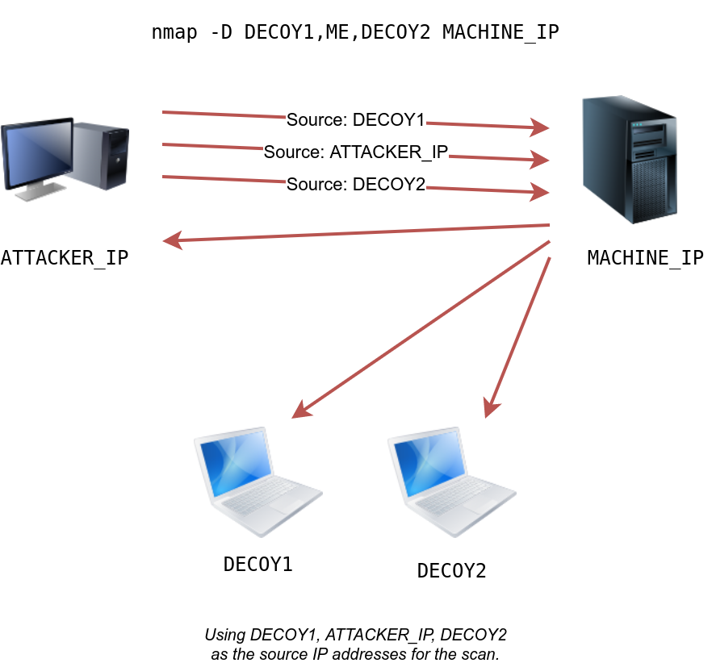

You can launch a decoy scan by specifying a specific or random IP address after -D. For example, nmap -D 10.10.0.1,10.10.0.2,ME 10.10.235.34 will make the scan of 10.10.235.34 appear as coming from the IP addresses 10.10.0.1, 10.10.0.2, and then ME to indicate that your IP address should appear in the third order. Another example command would be nmap -D 10.10.0.1,10.10.0.2,RND,RND,ME 10.10.235.34, where the third and fourth source IP addresses are assigned randomly, while the fifth source is going to be the attacker’s IP address. In other words, each time you execute the latter command, you would expect two new random IP addresses to be the third and fourth decoy sources.

### FRAGMENTED PACKETS

**Firewall**  
A firewall is a piece of software or hardware that permits packets to pass through or blocks them. It functions based on firewall rules, summarized as blocking all traffic with exceptions or allowing all traffic with exceptions. For instance, you might block all traffic to your server except those coming to your web server. A traditional firewall inspects, at least, the IP header and the transport layer header. A more sophisticated firewall would also try to examine the data carried by the transport layer.

**IDS**  
An intrusion detection system (IDS) inspects network packets for select behavioural patterns or specific content signatures. It raises an alert whenever a malicious rule is met. In addition to the IP header and transport layer header, an IDS would inspect the data contents in the transport layer and check if it matches any malicious patterns. How can you make it less likely for a traditional firewall/IDS to detect your Nmap activity? It is not easy to answer this; however, depending on the type of firewall/IDS, you might benefit from dividing the packet into smaller packets.

**Fragmented Packets**
Nmap provides the option `-f` to fragment packets. Once chosen, the IP data will be divided into 8 bytes or less.
Adding another `-f (-f -f or -ff)` will split the data into 16 byte-fragments instead of 8.
You can change the default value by using the `--mtu`;
however, you should always choose a multiple of 8.

To properly understand fragmentation, we need to look at the IP header in the figure below. It might look complicated at first, but we notice that we know most of its fields. In particular, notice the source address taking 32 bits (4 bytes) on the fourth row, while the destination address is taking another 4 bytes on the fifth row. The data that we will fragment across multiple packets is highlighted in red. To aid in the reassembly on the recipient side, IP uses the identification (ID) and fragment offset, shown on the second row of the figure below.


> return to this part Task 6 Fragmented Packets
> https://tryhackme.com/room/nmap03


### ZOMBIE SCAN / IDLE

Spoofing the source IP address can be a great approach to scanning stealthily. However, spoofing will only work in specific network setups. It requires you to be in a position where you can monitor the traffic. Considering these limitations, spoofing your IP address can have little use; however, we can give it an upgrade with the idle scan.
The idle scan, or zombie scan, requires an idle system connected to the network that you can communicate with. Practically, Nmap will make each probe appear as if coming from the idle (zombie) host, then it will check for indicators whether the idle (zombie) host received any response to the spoofed probe. This is accomplished by checking the IP identification (IP ID) value in the IP header. You can run an idle scan using nmap -sI ZOMBIE_IP 10.10.32.225, where ZOMBIE_IP is the IP address of the idle host (zombie) 

nmap -sI ZOMBIE_IP 10.10.32.225 

The idle (zombie) scan requires the following three steps to discover whether a port is open:

- Trigger the idle host to respond so that you can record the current IP ID on the idle host.
- Send a SYN packet to a TCP port on the target. The packet should be spoofed to appear as if it was coming from the idle host (zombie) IP address.
- Trigger the idle machine again to respond so that you can compare the new IP ID with the one received earlier.


### SUMMARY 

|         Port Scan Type         |                    Example Command                    |
|:------------------------------:|:-----------------------------------------------------:|
|          TCP Null Scan         |               sudo nmap -sN 10.10.32.225              |
|          TCP FIN Scan          |               sudo nmap -sF 10.10.32.225              |
|          TCP Xmas Scan         |               sudo nmap -sX 10.10.32.225              |
|         TCP Maimon Scan        |               sudo nmap -sM 10.10.32.225              |
|          TCP ACK Scan          |               sudo nmap -sA 10.10.32.225              |
|         TCP Window Scan        |               sudo nmap -sW 10.10.32.225              |
|         Custom TCP Scan        | sudo nmap --scanflags URGACKPSHRSTSYNFIN 10.10.32.225 |
|        Spoofed Source IP       |          sudo nmap -S SPOOFED_IP 10.10.32.225         |
|       Spoofed MAC Address      |                --spoof-mac SPOOFED_MAC                |
|           Decoy Scan           |            nmap -D DECOY_IP,ME 10.10.32.225           |
|       Idle (Zombie) Scan       |          sudo nmap -sI ZOMBIE_IP 10.10.32.225         |
|  Fragment IP data into 8 bytes |                           -f                          |
| Fragment IP data into 16 bytes |                          -ff                          |


|         Option         |                  Purpose                 |
|:----------------------:|:----------------------------------------:|
| --source-port PORT_NUM |        specify source port number        |
|    --data-length NUM   | append random data to reach given length |

These scan types rely on setting TCP flags in unexpected ways to prompt ports for a reply. Null, FIN, and Xmas scan provoke a response from closed ports, while Maimon, ACK, and Window scans provoke a response from open and closed ports.

 |  Option  |                Purpose                |
|:--------:|:-------------------------------------:|
| --reason | explains how Nmap made its conclusion |
|    -v    |                verbose                |
|    -vv   |              very verbose             |
|    -d    |               debugging               |
|    -dd   |       more details for debugging      | 

## NMAP POST PORT SCANS 

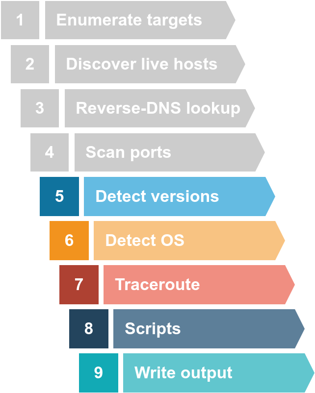

### Service Detection 

sudo nmap -sV 10.10.18.246
nmap -sV --version-light 10.10.18.246

The console output below shows a simple Nmap stealth SYN scan with the -sV option. Adding the -sV option leads to a new column in the output showing the version for each detected service. For instance, in the case of TCP port 22 being open, instead of 22/tcp open ssh, we obtain 22/tcp open ssh OpenSSH 6.7p1 Debian 5+deb8u8 (protocol 2.0). Notice that the SSH protocol is guessed as the service because TCP port 22 is open; Nmap didn’t need to connect to port 22 to confirm. However, -sV required connecting to this open port to grab the service banner and any version information it can get, such as nginx 1.6.2. Hence, unlike the service column, the version column is not a guess
```
pentester@TryHackMe$ sudo nmap -sV 10.10.18.246

Starting Nmap 7.60 ( https://nmap.org ) at 2021-09-10 05:03 BST
Nmap scan report for 10.10.18.246
Host is up (0.0040s latency).
Not shown: 995 closed ports
PORT    STATE SERVICE VERSION
22/tcp  open  ssh     OpenSSH 6.7p1 Debian 5+deb8u8 (protocol 2.0)
25/tcp  open  smtp    Postfix smtpd
80/tcp  open  http    nginx 1.6.2
110/tcp open  pop3    Dovecot pop3d
111/tcp open  rpcbind 2-4 (RPC #100000)
MAC Address: 02:A0:E7:B5:B6:C5 (Unknown)
Service Info: Host:  debra2.thm.local; OS: Linux; CPE: cpe:/o:linux:linux_kernel

Service detection performed. Please report any incorrect results at https://nmap.org/submit/ .
Nmap done: 1 IP address (1 host up) scanned in 8.40 seconds

```

### OS DETECTION AND TRACEROUTE


**OS DETECTION** 
Nmap can detect the Operating System (OS) based on its behaviour and any telltale signs in its responses. OS detection can be enabled using -O; this is an uppercase O as in OS. In this example, we ran nmap -sS -O 10.10.18.246 on the AttackBox. Nmap detected the OS to be Linux 3.X, and then it guessed further that it was running kernel 3.13.

```
pentester@TryHackMe$ sudo nmap -sS -O 10.10.18.246

Starting Nmap 7.60 ( https://nmap.org ) at 2021-09-10 05:04 BST
Nmap scan report for 10.10.18.246
Host is up (0.00099s latency).
Not shown: 994 closed ports
PORT    STATE SERVICE
22/tcp  open  ssh
25/tcp  open  smtp
80/tcp  open  http
110/tcp open  pop3
111/tcp open  rpcbind
143/tcp open  imap
MAC Address: 02:A0:E7:B5:B6:C5 (Unknown)
Device type: general purpose
Running: Linux 3.X
OS CPE: cpe:/o:linux:linux_kernel:3.13
OS details: Linux 3.13
Network Distance: 1 hop

OS detection performed. Please report any incorrect results at https://nmap.org/submit/ .
Nmap done: 1 IP address (1 host up) scanned in 3.91 seconds

```

**TRACEROUTE**

If you want Nmap to find the routers between you and the target, just add --traceroute. In the following example, Nmap appended a traceroute to its scan results. Note that Nmap’s traceroute works slightly different than the traceroute command found on Linux and macOS or tracert found on MS Windows. Standard traceroute starts with a packet of low TTL (Time to Live) and keeps increasing until it reaches the target. Nmap’s traceroute starts with a packet of high TTL and keeps decreasing it.

In the following example, we executed nmap -sS --traceroute 10.10.18.246 on the AttackBox. We can see that there are no routers/hops between the two as they are connected directly.

```
pentester@TryHackMe$ sudo nmap -sS --traceroute 10.10.18.246

Starting Nmap 7.60 ( https://nmap.org ) at 2021-09-10 05:05 BST
Nmap scan report for 10.10.18.246
Host is up (0.0015s latency).
Not shown: 994 closed ports
PORT    STATE SERVICE
22/tcp  open  ssh
25/tcp  open  smtp
80/tcp  open  http
110/tcp open  pop3
111/tcp open  rpcbind
143/tcp open  imap
MAC Address: 02:A0:E7:B5:B6:C5 (Unknown)

TRACEROUTE
HOP RTT     ADDRESS
1   1.48 ms MACHINE_IP

Nmap done: 1 IP address (1 host up) scanned in 1.59 seconds
```

### NMAP SCRIPTING ENGINE (NSE)

A part of Nmap, Nmap Scripting Engine (NSE) is a Lua interpreter that allows Nmap to execute Nmap scripts written in Lua language.

Your Nmap default installation can easily contain close to 600 scripts
`/usr/share/nmap/scripts`

You can choose to run the scripts in the default category using `--script=default` or simply adding `-sC` 

| Script Category |                               Description                              |
|:---------------:|:----------------------------------------------------------------------:|
|       auth      |                     Authentication related scripts                     |
|    broadcast    |              Discover hosts by sending broadcast messages              |
|      brute      |          Performs brute-force password auditing against logins         |
|     default     |                      Default scripts, same as -sC                      |
|    discovery    | Retrieve accessible information, such as database tables and DNS names |
|       dos       |          Detects servers vulnerable to Denial of Service (DoS)         |
|     exploit     |             Attempts to exploit various vulnerable services            |
|     external    |  Checks using a third-party service, such as Geoplugin and Virustotal  |
|      fuzzer     |                         Launch fuzzing attacks                         |
|    intrusive    |     Intrusive scripts such as brute-force attacks and exploitation     |
|     malware     |                           Scans for backdoors                          |
|       safe      |                Safe scripts that won’t crash the target                |
|     version     |                        Retrieve service versions                       |
|       vuln      |        Checks for vulnerabilities or exploit vulnerable services       | 


### SAVING THE OUTPUT 

The three main formats are:

- Normal
- Grepable (grepable)
- XML

**Normal**   
As the name implies, the normal format is similar to the output you get on the screen when scanning a target. You can save your scan in normal format by using -oN FILENAME; N stands for normal. Here is an example of the result.

**GREPABLE**
The grepable format has its name from the command grep
As a result, in grepable output, the lines are so long and are not convenient to read compared to normal output.

**XML**  
The third format is XML. You can save the scan results in XML format using -oX FILENAME. The XML format would be most convenient to process the output in other programs

### SUMMARY 

|          Option         |                          Meaning                          |
|:-----------------------:|:---------------------------------------------------------:|
|           -sV           |        determine service/version info on open ports       |
|   -sV --version-light   |               try the most likely probes (2)              |
|    -sV --version-all    |                try all available probes (9)               |
|            -O           |                         detect OS                         |
|       --traceroute      |                  run traceroute to target                 |
|     --script=SCRIPTS    |                    Nmap scripts to run                    |
| -sC or --script=default |                    run default scripts                    |
|            -A           |           equivalent to -sV -O -sC --traceroute           |
|           -oN           |                save output in normal format               |
|           -oG           |               save output in grepable format              |
|           -oX           |                 save output in XML format                 |
|           -oA           |      save output in normal, XML and Grepable formats      |
|         version         |                 Retrieve service versions                 |
|           vuln          | Checks for vulnerabilities or exploit vulnerable services |


## PROTOCOL AND SERVERS 


TELNET 

Using telnet as HTTP 
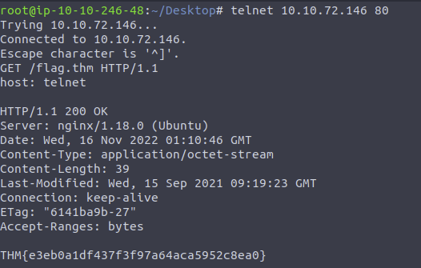

**Using FTP**
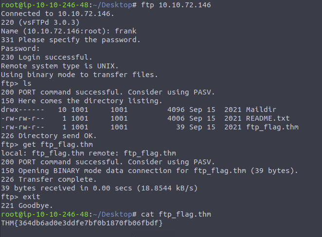

Because FTP sends the login credentials along with the commands and files in cleartext, FTP traffic can be an easy target for attackers

**SMTP**
Email delivery over the Internet requires the following components:
- Mail Submission Agent (MSA)
- Mail Transfer Agent (MTA)
- Mail Delivery Agent (MDA)
- Mail User Agent (MUA)

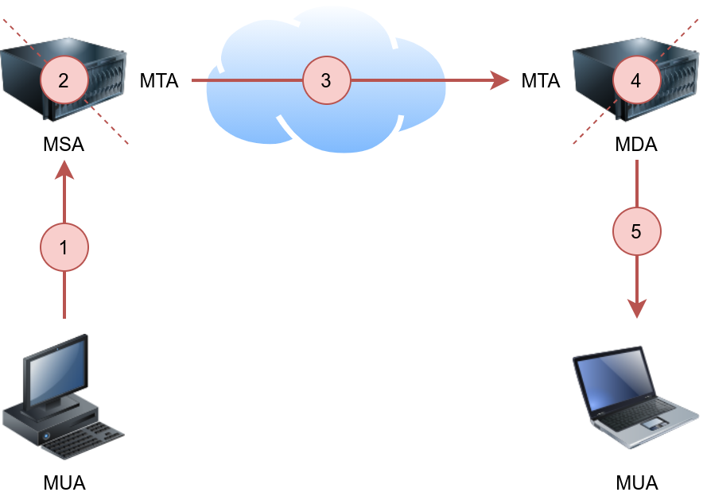

The figure shows the following five steps that an email needs to go through to reach the recipient’s inbox:
- A Mail User Agent (MUA), or simply an email client, has an email message to be sent. The MUA connects to a Mail Submission Agent (MSA) to send its message.
- The MSA receives the message, checks for any errors before transferring it to the Mail Transfer Agent (MTA) server, commonly hosted on the same server.
- The MTA will send the email message to the MTA of the recipient. The MTA can also function as a Mail Submission Agent (MSA).
- A typical setup would have the MTA server also functioning as a Mail Delivery Agent (MDA).
- The recipient will collect its email from the MDA using their email client.

If the above steps sound confusing, consider the following analogy:
- You (MUA) want to send postal mail.
- The post office employee (MSA) checks the postal mail for any issues before your local post office (MTA) accepts it.
- The local post office checks the mail destination and sends it to the post office (MTA) in the correct country.
- The post office (MTA) delivers the mail to the recipient mailbox (MDA).
- The recipient (MUA) regularly checks the mailbox for new mail. They notice the new mail, and they take it.

the same way, we need to follow a protocol to communicate with an HTTP server, and we need to rely on email protocols to talk with an MTA and an MDA. The protocols are:

- Simple Mail Transfer Protocol (SMTP)
- Post Office Protocol version 3 (POP3) or Internet Message Access Protocol (IMAP)


### SUMMARY 
| Protocol | TCP Port | Application(s) | Data Security |
|:--------:|:--------:|:--------------:|:-------------:|
|    FTP   |    21    |  File Transfer |   Cleartext   |
|   HTTP   |    80    |  Worldwide Web |   Cleartext   |
|   IMAP   |    143   |   Email (MDA)  |   Cleartext   |
|   POP3   |    110   |   Email (MDA)  |   Cleartext   |
|   SMTP   |    25    |   Email (MTA)  |   Cleartext   |
|  Telnet  |    23    |  Remote Access |   Cleartext   |


## SERVERS AND PROTOCOL 2

Servers implementing these protocols are subject to different kinds of attacks. To name a few, consider:

- Sniffing Attack (Network Packet Capture)
- Man-in-the-Middle (MITM) Attack
- Password Attack (Authentication Attack)
- Vulnerabilities

From a security perspective, we always need to think about what we aim to protect; consider the security triad: Confidentiality, Integrity, and Availability (CIA). Confidentiality refers to keeping the contents of the communications accessible to the intended parties. Integrity is the idea of assuring any data sent is accurate, consistent, and complete when reaching its destination. Finally, availability refers to being able to access the service when we need it. Different parties will put varying emphasis on these three. For instance, confidentiality would be the highest priority for an intelligence agency. Online banking will put most emphasis on the integrity of transactions. Availability is of the highest importance for any platform making money by serving ads.

Knowing that we are protecting the Confidentiality, Integrity, and Availability (CIA), an attack aims to cause Disclosure, Alternation, and Destruction (DAD). The figures below reflect this.


### MAN IN THE MIDDLE 

A Man-in-the-Middle (MITM) attack occurs when a victim (A) believes they are communicating with a legitimate destination (B) but is unknowingly communicating with an attacker (E). In the figure below, we have A requesting the transfer of $20 to M; however, E altered this message and replaced the original value with a new one. B received the modified messaged and acted on it.

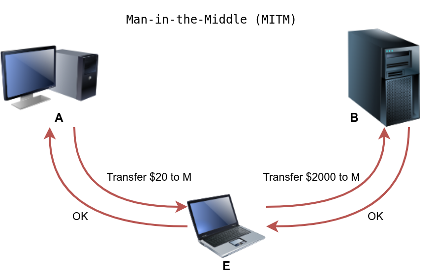


### PASSWORD ATTACK

want an automated way to try the common passwords or the entries from a word list; here comes THC Hydra. Hydra supports many protocols, including FTP, POP3, IMAP, SMTP, SSH, and all methods related to HTTP. 
The general command-line syntax is: `hydra -l username -P wordlist.txt` server service where we specify the following options:

- -l username: -l should precede the username, i.e. the login name of the target.
- -P wordlist.txt: -P precedes the wordlist.txt file, which is a text file containing the list of passwords you want to try with the provided username.
- server is the hostname or IP address of the target server.
- service indicates the service which you are trying to launch the dictionary attack.

Consider the following concrete examples:

- hydra -l mark -P /usr/share/wordlists/rockyou.txt 10.10.70.212 ftp will use mark as the username as it iterates over the provided passwords against the FTP server.
- hydra -l mark -P /usr/share/wordlists/rockyou.txt ftp://10.10.70.212 is identical to the previous example. 10.10.70.212 ftp is the same as ftp://10.10.70.212.
- hydra -l frank -P /usr/share/wordlists/rockyou.txt 10.10.70.212 ssh will use frank as the user name as it tries to login via SSH using the different passwords.

There are some extra optional arguments that you can add:

- -s PORT to specify a non-default port for the service in question.
- -V or -vV, for verbose, makes Hydra show the username and password combinations that are being tried. This verbosity is very convenient to see the progress, especially if you are still not confident of your command-line syntax.
- -t n where n is the number of parallel connections to the target. -t 16 will create 16 threads used to connect to the target.
- -d, for debugging, to get more detailed information about what’s going on. The debugging output can save you much frustration; for instance, if Hydra tries to connect to a closed port and timing out, -d will reveal this right away.

**CHALLENGE**  
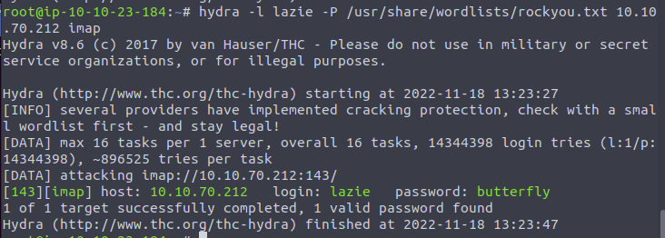


### SUMMARY 

This room covered various protocols, their usage, and how they work under the hood. Three common attacks are:

Sniffing Attack
MITM Attack
Password Attack
For each of the above, we focused both on the attack details and the mitigation steps.

Many other attacks can be conducted against specific servers and protocols. We will provide a list of some related modules.

- Vulnerability Research: This module provides more information about vulnerabilities and exploits.
- Metasploit: This module trains you on how to use Metasploit to exploit target systems.
- Burp Suite: This module teaches you how to use Burp Suite to intercept HTTP traffic and launch attacks related to the web.
It is good to remember the default port number for common protocols. For convenience, the services we covered are listed in the following table sorted by alphabetical order.

| Protocol | TCP Port |          Application(s)         | Data Security |
|:--------:|:--------:|:-------------------------------:|:-------------:|
|    FTP   |    21    |          File Transfer          |   Cleartext   |
|   FTPS   |    990   |          File Transfer          |   Encrypted   |
|   HTTP   |    80    |          Worldwide Web          |   Cleartext   |
|   HTTPS  |    443   |          Worldwide Web          |   Encrypted   |
|   IMAP   |    143   |           Email (MDA)           |   Cleartext   |
|   IMAPS  |    993   |           Email (MDA)           |   Encrypted   |
|   POP3   |    110   |           Email (MDA)           |   Cleartext   |
|   POP3S  |    995   |           Email (MDA)           |   Encrypted   |
|   SFTP   |    22    |          File Transfer          |   Encrypted   |
|    SSH   |    22    | Remote Access and File Transfer |   Encrypted   |
|   SMTP   |    25    |           Email (MTA)           |   Cleartext   |
|   SMTPS  |    465   |           Email (MTA)           |   Encrypted   |
|  Telnet  |    23    |          Remote Access          |   Cleartext   |

Hydra remains a very efficient tool that you can launch from the terminal to try the different passwords. We summarize its main options in the following table.

|      Option     |                          Explanation                          |
|:---------------:|:-------------------------------------------------------------:|
|   -l username   |                     Provide the login name                    |
| -P WordList.txt |                Specify the password list to use               |
|  server service |          Set the server address and service to attack         |
|     -s PORT     |         Use in case of non-default service port number        |
|    -V or -vV    |    Show the username and password combinations being tried    |
|        -d       | Display debugging output if the verbose output is not helping | 


## NET SEC CHALLENGE 

Answer the questions below

**What is the highest port number being open less than 10,000?**
`8080`


**There is an open port outside the common 1000 ports; it is above 10,000. What is it?**
`10021`

**How many TCP ports are open?**
6

**What is the flag hidden in the HTTP server header?**
`THM{web_server_25352}`

**What is the flag hidden in the SSH server header?**
`THM{946219583339}`

**We have an FTP server listening on a nonstandard port. What is the version of the FTP server?**
`vsftpd 3.0.3`

```
sudo nmap -sC -sV -p- -T4 --min-rate 8888 -vv 10.10.220.100 
root@ip-10-10-212-73: nmap -sC -sV -p- -T4 -min-rate 8888 -vv 10.10.220.100

Starting Nmap 7.60 ( https://nmap.org ) at 2022-11-19 08:27 GMT
NSE: Loaded 146 scripts for scanning.
NSE: Script Pre-scanning.
NSE: Starting runlevel 1 (of 2) scan.
Initiating NSE at 08:27
Completed NSE at 08:27, 0.00s elapsed
NSE: Starting runlevel 2 (of 2) scan.
Initiating NSE at 08:27
Completed NSE at 08:27, 0.00s elapsed
Initiating ARP Ping Scan at 08:27
Scanning 10.10.220.100 [1 port]
Completed ARP Ping Scan at 08:27, 0.23s elapsed (1 total hosts)
Initiating Parallel DNS resolution of 1 host. at 08:27
Completed Parallel DNS resolution of 1 host. at 08:27, 0.00s elapsed
Initiating SYN Stealth Scan at 08:27
Scanning ip-10-10-220-100.eu-west-1.compute.internal (10.10.220.100) [65535 ports]
Discovered open port 445/tcp on 10.10.220.100
Discovered open port 8080/tcp on 10.10.220.100
Discovered open port 139/tcp on 10.10.220.100
Discovered open port 22/tcp on 10.10.220.100
Discovered open port 80/tcp on 10.10.220.100
Increasing send delay for 10.10.220.100 from 0 to 5 due to max_successful_tryno increase to 5
Increasing send delay for 10.10.220.100 from 5 to 10 due to max_successful_tryno increase to 6
Warning: 10.10.220.100 giving up on port because retransmission cap hit (6).
Discovered open port 10021/tcp on 10.10.220.100
Completed SYN Stealth Scan at 08:27, 10.74s elapsed (65535 total ports)
Initiating Service scan at 08:27
Scanning 6 services on ip-10-10-220-100.eu-west-1.compute.internal (10.10.220.100)
Completed Service scan at 08:29, 121.16s elapsed (6 services on 1 host)
NSE: Script scanning 10.10.220.100.
NSE: Starting runlevel 1 (of 2) scan.
Initiating NSE at 08:29
Completed NSE at 08:29, 3.27s elapsed
NSE: Starting runlevel 2 (of 2) scan.
Initiating NSE at 08:29
Completed NSE at 08:29, 1.02s elapsed
Nmap scan report for ip-10-10-220-100.eu-west-1.compute.internal (10.10.220.100)
Host is up, received arp-response (0.00051s latency).
Scanned at 2022-11-19 08:27:40 GMT for 137s
Not shown: 65529 closed ports
Reason: 65529 resets
PORT      STATE SERVICE       REASON         VERSION
22/tcp    open  ssh           syn-ack ttl 64 (protocol 2.0)
| fingerprint-strings:
|   NULL:
|_    SSH-2.0-OpenSSH_8.2p1 THM{946219583339}
80/tcp    open  http          syn-ack ttl 64 lighttpd
| http-methods:
|_  Supported Methods: OPTIONS GET HEAD POST
|_http-server-header: lighttpd THM{web_server_25352}
|_http-title: Hello, world!
139/tcp   open  netbios-ssn?  syn-ack ttl 64
| fingerprint-strings:
|   SMBProgNeg:
|_    SMBr
445/tcp   open  microsoft-ds? syn-ack ttl 64
| fingerprint-strings:
|   SMBProgNeg:
|_    SMBr
8080/tcp  open  http          syn-ack ttl 64 Node.js (Express middleware)
| http-methods:
|_  Supported Methods: GET HEAD POST OPTIONS
|_http-open-proxy: Proxy might be redirecting requests
|_http-title: Site doesn't have a title (text/html; charset=utf-8).
10021/tcp open  ftp           syn-ack ttl 64 vsftpd 3.0.3
3 services unrecognized despite returning data. If you know the service/version, please submit the following fingerprints at https://nmap.org/cgi-bin/submit.cgi?new-service :
==============NEXT SERVICE FINGERPRINT (SUBMIT INDIVIDUALLY)==============
SF-Port22-TCP:V=7.60%I=7%D=11/19%Time=6378938D%P=x86_64-pc-linux-gnu%r(NUL
SF:L,29,"SSH-2\.0-OpenSSH_8\.2p1\x20THM{946219583339}\r\n");
==============NEXT SERVICE FINGERPRINT (SUBMIT INDIVIDUALLY)==============
SF-Port139-TCP:V=7.60%I=7%D=11/19%Time=63789392%P=x86_64-pc-linux-gnu%r(SM
SF:BProgNeg,29,"\0\0\0%\xffSMBr\0\0\0\0\x88\x03@\0\0\0\0\0\0\0\0\0\0\0\0\0
SF:\0@\x06\0\0\x01\0\x01\xff\xff\0\0");
==============NEXT SERVICE FINGERPRINT (SUBMIT INDIVIDUALLY)==============
SF-Port445-TCP:V=7.60%I=7%D=11/19%Time=6378938D%P=x86_64-pc-linux-gnu%r(SM
SF:BProgNeg,29,"\0\0\0%\xffSMBr\0\0\0\0\x88\x03@\0\0\0\0\0\0\0\0\0\0\0\0\0
SF:\0@\x06\0\0\x01\0\x01\xff\xff\0\0");
MAC Address: 02:94:F9:DA:5B:4D (Unknown)
Service Info: OS: Unix

Host script results:
| nbstat: NetBIOS name: NETSEC-CHALLENG, NetBIOS user: <unknown>, NetBIOS MAC: <unknown> (unknown)
| Names:
|   NETSEC-CHALLENG<00>  Flags: <unique><active>
|   NETSEC-CHALLENG<03>  Flags: <unique><active>
|   NETSEC-CHALLENG<20>  Flags: <unique><active>
|   WORKGROUP<00>        Flags: <group><active>
|   WORKGROUP<1e>        Flags: <group><active>
| Statistics:
|   00 00 00 00 00 00 00 00 00 00 00 00 00 00 00 00 00
|   00 00 00 00 00 00 00 00 00 00 00 00 00 00 00 00 00
|_  00 00 00 00 00 00 00 00 00 00 00 00 00 00
| p2p-conficker:
|   Checking for Conficker.C or higher...
|   Check 1 (port 53513/tcp): CLEAN (Couldn't connect)
|   Check 2 (port 36709/tcp): CLEAN (Couldn't connect)
|   Check 3 (port 57810/udp): CLEAN (Failed to receive data)
|   Check 4 (port 11635/udp): CLEAN (Failed to receive data)
|_  0/4 checks are positive: Host is CLEAN or ports are blocked
| smb2-security-mode:
|   2.02:
|_    Message signing enabled but not required
| smb2-time:
|   date: 2022-11-19 08:29:53
|_  start_date: 1600-12-31 23:58:45

NSE: Script Post-scanning.
NSE: Starting runlevel 1 (of 2) scan.
Initiating NSE at 08:29
Completed NSE at 08:29, 0.00s elapsed
NSE: Starting runlevel 2 (of 2) scan.
Initiating NSE at 08:29
Completed NSE at 08:29, 0.00s elapsed
Read data files from: /usr/bin/../share/nmap
Service detection performed. Please report any incorrect results at https://nmap.org/submit/ .
Nmap done: 1 IP address (1 host up) scanned in 136.93 seconds
           Raw packets sent: 92287 (4.061MB) | Rcvd: 92287 (3.691MB)

```


**We learned two usernames using social engineering: eddie and quinn. What is the flag hidden in one of these two account files and accessible via FTP?**
`THM{321452667098}`
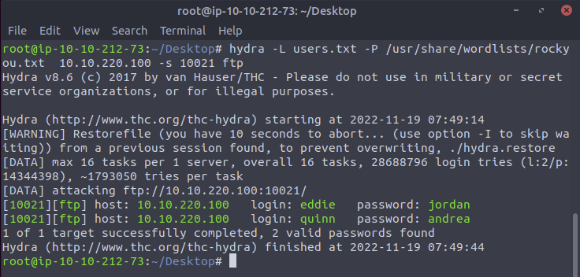


**Browsing to http://10.10.220.100:8080 displays a small challenge that will give you a flag once you solve it. What is the flag?**
`nmap -sN 10.10.220.100 `

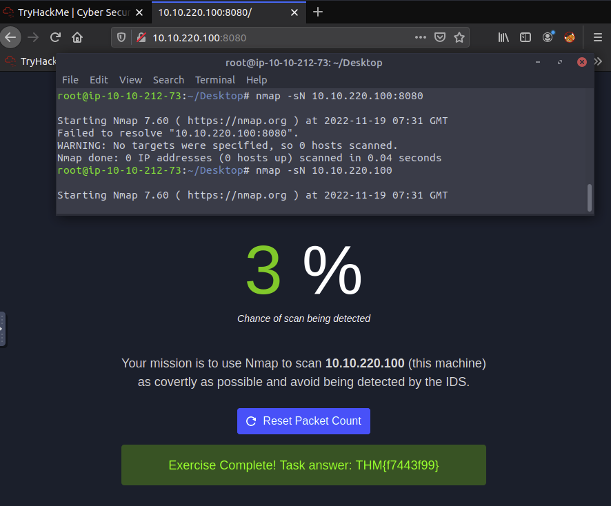


## MY NOTES 


```bash
#PASSIVE RECON - Public info

nslookup -type=A tryhackme.com     # IPv4 Address
nslookup -type=MX tryhackme.com 1.1.1.1  # Mail Servers
nslookup -type=TXT tryhackme.com     # Txt records

```

other useful sites 
- DNSDumpster 
- shodan.io


NMAP NULL SCAN - lack of reply either port is open or firewall is blocking 
NMAP ACK SCAN - scan twice if there's a firewall 

